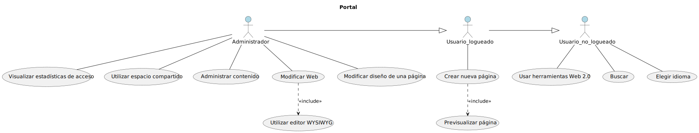

# ***Proyecto***
 
 

## ***Índice de contenidos***

Hoja de revisión.  
Contenidos.
1. Introducción.
2. Información del Dominio del problema.  
2.1. Organigrama.  
2.2. Glosario de términos.
3. Necesidades del negocio.  
3.1. Objetivos del negocio.  
3.2. Modelos de Proceso de Negocio.  
3.2.1. Sub-procesos.  
3.2.2. Tareas.  
4. Requisitos del sistema a desarrollar.  
4.1. Requisitos.  
4.2. Casos de uso.  
4.2.1. Lista de diagramas de casos de uso del modelo.  
4.2.2. Diagramas de casos de uso.  
4.2.3. Lista general de casos de uso y actores del proyecto.  
4.2.4. Detalle de los casos de uso.  
4.3. Diagramas de clases asociados a los requisitos de información.  

Apendices 

 

# 1. Introducción.

 

# 2. Información del Domino del problema.

## 2.1. Organigrama.

 

## 2.2. Glosario de términos.

 

| Término                  | Descripción                     |
| :---                     | :---                            |
| WYSIWYG                  | Acrónimo de «Lo que ves obtienes», (What you see is what you get) es una frase aplicada a los procesadores de texto y otros editores de texto con formato (como los editores de HTML) que permiten escribir un documento mostrando directamente el resultado final, frecuentemente el resultado impreso.                                                     |
| CEN                      | Las nubes de etiquetas consisten en agrupar palabras (etiquetas, tags) y mostrarle al visitante de la web cuales son las etiquetas más usadas, usando también estilos que permiten visualizar mejor cual tiene mayor actividad y cual tiene menor actividad.          |
| SIIT                     | Comité Europeo de Normalización |
| SMET                     | Sistema interactivo de información del transporte |
| HelpDesk                 | Sistema de la monitorización de la explotación del transporte |
| SAE                      |  |
| PDA                      |  |
| LOPD                     |  |
| AUT                      | Autoridad Única del Transporte |

 

# 3. Necesidades del negocio.

## 3.1. Objetivos del negocio.

| OBJ-1                 		  | Gestión del Portal del SIIT   |
| :---                    		  | :---                          |
| Versión                         | 2.0                           |
| Descripción                     | El sistema deberá implementar un Portal Web que cuente tanto con las necesidades de los usuarios como el análisis técnico. Se deberá implementar la identificación de necesidades (contenidos, servicios, audiencias,…), 
definición de la estructura (arquitectura de la información, mapa web,…) y organización 
del portal, detallar componentes organizativos, funcionales y técnicos del mismo. |
| Comentarios                     |                               |

 

| OBJ-2                 		  | Gestión de los sistemas de la información del SIIT   |
| :---                    		  | :---                          |
| Versión                         | 2.0                           |
| Descripción                     | El sistema deberá implementar un sistema integrado de información de la red de transporte 
público de todos los municipios de Gran Canaria que proporcione herramientas de análisis, 
consulta, localización y gestión, con el objeto de que el usuario del transporte público pueda 
consultar de forma dinámica la información del servicio permitiéndole conocer y programar 
con antelación su viaje.                               |
| Comentarios                     |                               |

 

| OBJ-3                 		  | Gestión del SMET   |
| :---                    		  | :---                          |
| Versión                         | 2.0                           |
| Descripción                     | El sistema deberá implementar el análisis, diseño, implementación y la puesta en marcha de un sistema de información central sobre la explotación para la Autoridad Única del Transportes cuya misión fundamental sea la de monitorizar en tiempo real el estado de la red de transporte público por carretera en la Isla de Gran Canaria. |
| Comentarios                     |                               |

 

## 3.2. Modelos de Procesos de Negocio.

 

### 3.2.1. Sub-procesos.

DIAGRAMA BPMN

 

 

### 3.2.2. Tareas.

ENUNCIADO BPMN

 

| Nombre                   | Descripción                   |
| :---                     | :---                          |
|                          |                               |

 

# 4. Requisitos del sistema a desarrollar.

## 4.1. Requisitos.

### 4.1.1 Gestor de contenidos.

Requisitos Funcionales

 

| RF-01					| Gestor de contenido	|
| :---					| :----  	|
| Versión				|		|
| Autores				| Cristina García, Adrián Galdeano, Alejandro Manzano		|
| Fuentes				|		|
| Objetivos asociados	|		|
| Requisitos asociados	|		|
| Descripción			| El SIIT deberá poseer un sistema propio que pueda ser utilizado para administrar el contenido y la información del sistema interactivo. Así como, las herramientas necesarias para el mantenimiento del mismo.		|
| Importancia			|		|
| Urgencia				|		|
| Estado				|		|
| Estabilidad			|		|
| Comentarios			| 		|

 

| RF-02					| Acceso web con editor WYSIWYG		|
| :---					| :----  	|
| Versión				|		|
| Autores				| Cristina García, Adrián Galdeano, Alejandro Manzano		|
| Fuentes				|		|
| Objetivos asociados	|		|
| Requisitos asociados	| RF-01		|
| Descripción			| El sistema deberá poseer acceso web con un editor WYSIWYG para el gestor de contenido.		|
| Importancia			|		|
| Urgencia				|		|
| Estado				|		|
| Estabilidad			|		|
| Comentarios			| WYSIWYG (What You See Is What You Get) implica que el editor deberá mostrar siempre la versión final del archivo que se está creando o editando.		|

 

| RF-03					| Creación de páginas de forma sencilla y coherente		|
| :---					| :---- 	|
| Versión				|		|
| Autores				| Cristina García, Adrián Galdeano, Alejandro Manzano		|
| Fuentes				|		|
| Objetivos asociados	|		|
| Requisitos asociados	| RF-01		|
| Descripción			| El sistema deberá proporcionar las herramientas para la creación de páginas de forma sencilla y coherente con el resto de la Web a usuarios finales que no tengan conocimiento de programación ni de HTML.		|
| Importancia			|		|
| Urgencia				|		|
| Estado				|		|
| Estabilidad			|		|
| Comentarios			|		|

 

| RF-04					| Previsualización de la publicación de una página		|
| :---					| :---- 	|
| Versión				|		|
| Autores				| Cristina García, Adrián Galdeano, Alejandro Manzano		|
| Fuentes				|		|
| Objetivos asociados	|		|
| Requisitos asociados	| RF-01		|
| Descripción			| El gestor de contenidos debe de poseer una función para previsualizar la versión final de la página previamente a que esta sea publicada de manera definitiva.		|
| Importancia			|		|
| Urgencia				|		|
| Estado				|		|
| Estabilidad			|		|
| Comentarios			|		|

 

| RF-05					| Modificación sencilla del diseño		|
| :---					| :----  	|
| Versión				|		|
| Autores				| Cristina García, Adrián Galdeano, Alejandro Manzano		|
| Fuentes				|		|
| Objetivos asociados	|		|
| Requisitos asociados	| RF-01		|
| Descripción			| El sistema deberá proporcionar las herramientas para la modificación sencilla del diseño común a varias páginas o de la Web entera.		|
| Importancia			|		|
| Urgencia				|		|
| Estado				|		|
| Estabilidad			|		|
| Comentarios			|		|

 

| RF-06					| Contenido flexible		|
| :---					| :----  	|
| Versión				|		|
| Autores				| Cristina García, Adrián Galdeano, Alejandro Manzano		|
| Fuentes				|		|
| Objetivos asociados	|		|
| Requisitos asociados	|		|
| Descripción			| Todo contenido de la web de cualquier tipo deberá de poder ser publicado, retirado y modificado por el gestor de contenido.		|
| Importancia			|		|
| Urgencia				|		|
| Estado				|		|
| Estabilidad			|		|
| Comentarios			|		|

 

| RF-07					| Herramientas de seguimiento		|
| :---					| :----  	|
| Versión				|		|
| Autores				| Cristina García, Adrián Galdeano, Alejandro Manzano		|
| Fuentes				|		|
| Objetivos asociados	|		|
| Requisitos asociados	| RF-01		|
| Descripción			| Estadísticas de acceso a las distintas Secciones y Servicios.		|
| Importancia			|		|
| Urgencia				|		|
| Estado				|		|
| Estabilidad			|		|
| Comentarios			|		|

 

| RF-08					| Entorno de colaboración		|
| :---					| :----  	|
| Versión				|		|
| Autores				| Cristina García, Adrián Galdeano, Alejandro Manzano		|
| Fuentes				|		|
| Objetivos asociados	|		|
| Requisitos asociados	| El entorno de colaboración estará enfocado a facilitar la comunicación e intercambio de información.		|
| Descripción			|		|
| Importancia			|		|
| Urgencia				|		|
| Estado				|		|
| Estabilidad			|		|
| Comentarios			|		|

 

| RF-09					| Espacios para el trabajo compartido y en colaboración en la AUT		|
| :---					| :---- 	|
| Versión				|		|
| Autores				| Cristina García, Adrián Galdeano, Alejandro Manzano		|
| Fuentes				|		|
| Objetivos asociados	|		|
| Requisitos asociados	| RF-08		|
| Descripción			| Espacios para el trabajo compartido y en colaboración en la AUT		|
| Importancia			|		|
| Urgencia				|		|
| Estado				|		|
| Estabilidad			|		|
| Comentarios			|		|

 

| RF-10					| Herramientas web 2.0 para los usuarios del transporte público		|
| :---					| :----  	|
| Versión				|		|
| Autores				| Cristina García, Adrián Galdeano, Alejandro Manzano		|
| Fuentes				|		|
| Objetivos asociados	|		|
| Requisitos asociados	| RF-08		|
| Descripción			| Herramientas web 2.0 para los usuarios del transporte público! Foro, Blog, y relación de cloud tag en la home del website.		|
| Importancia			|		|
| Urgencia				|		|
| Estado				|		|
| Estabilidad			|		|
| Comentarios			|		|

 

| RF-11					| Buscador		|
| :---					| :----  	|
| Versión				|		|
| Autores				| Cristina García, Adrián Galdeano, Alejandro Manzano		|
| Fuentes				|		|
| Objetivos asociados	|		|
| Requisitos asociados	|		|
| Descripción			| El buscador permitirá la localización de cualquier contenido mediante la introducción de términos clave. En las búsquedas no se diferenciarán las palabras con o sin acento, mayúsculas o minúsculas. Dispondrá de opciones que permitan la parametrización de las búsquedas considerado entre otras características: idioma, secciones del sitio, etc. 		|
| Importancia			|		|
| Urgencia				|		|
| Estado				|		|
| Estabilidad			|		|
| Comentarios			|		|

Requisitos No Funcionales

 

| RNF-01		    	| Análisis del portal		|
| :---					| :----  	|
| Objetivos asociados	|		|
| Requisitos asociados	|		|
| Descripción			| Definir, a través de un análisis completo, tanto el enfoque del portal y necesidades de los usuarios como el análisis técnico.		|
| Comentarios			|		|

 

| RNF-02		    	| Recopilar información		|
| :---					| :----  	|
| Objetivos asociados	|		|
| Requisitos asociados	| RNF-01		|
| Descripción			| Identificación de necesidades (contenidos, servicios, audiencias,…), definición de la estructura (arquitectura de la información, mapa web,…) y organización del portal, detallar componentes organizativos, funcionales y técnicos del mismo.		|
| Comentarios			|		|

 

| RNF-03		    	| Propuesta de home e interior		|
| :---					| :----  	|
| Objetivos asociados	|		|
| Requisitos asociados	| RNF-01		|
| Descripción			| La empresa adjudicataria deberá presentar dos propuestas de home e interior, que deberán reflejar menús, iconografía, colores, estilos, etc, de modo que quede determinada la línea de comunicación e imagen en Internet del Proyecto y de los servicios.		|
| Comentarios			|		|

 

| RNF-04		    	| Tareas del Proyecto		|
| :---					| :----  	|
| Objetivos asociados	|		|
| Requisitos asociados	| RNF-01, RNF-03		|
| Descripción			| Las tareas, una vez asignado el proyecto serán: Diseño del interfaz, Diseño de páginas tipo, Definición del estilo gráfico de comunicación y promoción on-line, Creación del libro de estilo y de la marca en canales digitales.		|
| Comentarios			|		|

 

| RNF-05		    	| Requerimientos técnicos		|
| :---					| :----  	|
| Objetivos asociados	|		|
| Requisitos asociados	| RNF-01		|
| Descripción			| En función de los análisis realizados, se establecerán los requerimientos técnicos con los que debe cumplir la plataforma que soporte el portal y sus servicios.		|
| Comentarios			|		|

 

| RNF-06		    	| Ciclo de vida del software		|
| :---					| :----  	|
| Objetivos asociados	|		|
| Requisitos asociados	|		|
| Descripción			| Diseño, desarrollo, puesta en marcha, alojamiento y mantenimiento de la plataforma tecnológica para difusión, soporte y comunicación de contenidos referentes al transporte público.		|
| Comentarios			|		|

 

| RNF-07		    	| Diseño de la arquitectura		|
| :---					| :----  	|
| Objetivos asociados	|		|
| Requisitos asociados	|		|
| Descripción			| Diseño de la arquitectura tanto física como lógica.		|
| Comentarios			|		|

 

| RNF-08		    	| Diseño del modelo de datos		|
| :---					| :----  	|
| Objetivos asociados	|		|
| Requisitos asociados	|		|
| Descripción			| Diseño del modelo de datos, que preferentemente debe corresponderse con alguno de los estándares europeos definidos por el CEN (comité europeo de normalización). 		|
| Comentarios			|		|

 

| RNF-10		    	| Desarrollo o adaptación de las aplicaciones		|
| :---					| :----  	|
| Objetivos asociados	|		|
| Requisitos asociados	|		|
| Descripción			| Descripción general de la solución propuesta, arquitectura de hardware, arquitectura de software, descripción de cada uno de los componentes.		|
| Comentarios			|		|

 

| RNF-11		    	| Versión multidispositivo		|
| :---					| :----  	|
| Objetivos asociados	|		|
| Requisitos asociados	|		|
| Descripción			| Desarrollo o adaptación de las aplicaciones necesarias para el correcto funcionamiento del portal.		|
| Comentarios			|		|

 

| RNF-12		    	| Detallar los lenguajes y navegadores soportados		|
| :---					| :----  	|
| Objetivos asociados	|		|
| Requisitos asociados	|		|
| Descripción			| Versión multidispositivo.		|
| Comentarios			|		|

 

| RNF-13		    	| Propuesta inicial		|
| :---					| :----  	|
| Objetivos asociados	|		|
| Requisitos asociados	|		|
| Descripción			| Elaborar una propuesta inicial de contenido recopilando todo lo disponible en diversas fuentes y sometiéndola al visto bueno de la AUTGC, la cual a su vez facilitará los medios que estén a su disposición para facilitar el trabajo.		|
| Comentarios			|		|

 

| RNF-14		    	| Carga inicial		|
| :---					| :----  	|
| Objetivos asociados	|		|
| Requisitos asociados	|		|
| Descripción			| La carga inicial de los contenidos acordados en el gestor.		|
| Comentarios			|		|

 

| RNF-15		    	| Maquetación		|
| :---					| :----  	|
| Objetivos asociados	|		|
| Requisitos asociados	|		|
| Descripción			| Maquetación conforme a las pautas dadas y plantillas existentes en el gestor.		|
| Comentarios			|		|

 

| RNF-16		    	| Actualización		|
| :---					| :----  	|
| Objetivos asociados	|		|
| Requisitos asociados	|		|
| Descripción			| Actualización continúa durante todo el contrato de dichos contenidos, de acuerdo con el tipo de cada uno de ellos, y sobre todo vigilando que no se presenten contenidos obsoletos en ningún caso.		|
| Comentarios			|		|

### 4.1.2 Sistemas de la información.

Requisitos Funcionales

 

| RF-01					| Mapas relacionados con el transporte público de Gran Canaria		|
| :---					| :--  	|
| Versión				|		|
| Autores				| Cristina García, Adrián Galdeano, Alejandro Manzano		|
| Fuentes				|		|
| Objetivos asociados	| OBJ-02		|
| Requisitos asociados	|		|
| Descripción			| El sistema debe poseer toda la información integrada de la red de transporte público de todos los municipios de Gran Canaria.		|
| Importancia			|		|
| Urgencia				|		|
| Estado				|		|
| Estabilidad			|		|
| Comentarios			|		|

 

| RF-02					| Calcular distancias entre paradas		|
| :---					| :--  	|
| Versión				|		|
| Autores				| Cristina García, Adrián Galdeano, Alejandro Manzano		|
| Fuentes				|		|
| Objetivos asociados	|		|
| Requisitos asociados	|		|
| Descripción			| El sistema debe ser capaz de calcular la distancia entre dos paradas de cada transporte.		|
| Importancia			|		|
| Urgencia				|		|
| Estado				|		|
| Estabilidad			|		|
| Comentarios			|		|

 

| RF-03					| Definir transbordos		|
| :---					| :--  	|
| Versión				|		|
| Autores				| Cristina García, Adrián Galdeano, Alejandro Manzano		|
| Fuentes				|		|
| Objetivos asociados	|		|
| Requisitos asociados	|		|
| Descripción			| El sistema deberás ser capaz de crear transbordos entre los viajes para optimizar la eficiencia de las rutas de los vehículos.		|
| Importancia			|		|
| Urgencia				|		|
| Estado				|		|
| Estabilidad			|		|
| Comentarios			|		|

 

| RF-04					| Calcular tiempos de recorrido		|
| :---					| :--  	|
| Versión				|		|
| Autores				| Cristina García, Adrián Galdeano, Alejandro Manzano		|
| Fuentes				|		|
| Objetivos asociados	|		|
| Requisitos asociados	|		|
| Descripción			| El sistema deberá de ser capaz de calcular un tiempo estimado para el trayecto de un recorrido completo.		|
| Importancia			|		|
| Urgencia				|		|
| Estado				|		|
| Estabilidad			|		|
| Comentarios			|		|

 

| RF-05					| Identificar zonas por las que no se puede transitar		|
| :---					| :--  	|
| Versión				|		|
| Autores				| Cristina García, Adrián Galdeano, Alejandro Manzano		|
| Fuentes				|		|
| Objetivos asociados	|		|
| Requisitos asociados	|		|
| Descripción			| El sistema de ser capaz de identificar zonas intransitables y elaborar una ruta alternativa para llegar al destino.		|
| Importancia			|		|
| Urgencia				|		|
| Estado				|		|
| Estabilidad			|		|
| Comentarios			|		|

 

| RF-06					| Definir barrios, zonas y municipios		|
| :---					| :--  	|
| Versión				|		|
| Autores				| Cristina García, Adrián Galdeano, Alejandro Manzano		|
| Fuentes				|		|
| Objetivos asociados	|		|
| Requisitos asociados	|		|
| Descripción			| El sistema debe poder realizar la definición.		|
| Importancia			|		|
| Urgencia				|		|
| Estado				|		|
| Estabilidad			|		|
| Comentarios			|		|

 

| RF-07					| Seleccionar origen desde el mapa		|
| :---					| :--  	|
| Versión				|		|
| Autores				| Cristina García, Adrián Galdeano, Alejandro Manzano		|
| Fuentes				|		|
| Objetivos asociados	|		|
| Requisitos asociados	|		|
| Descripción			| El usuario podrá introducir un lugar de origen en el mapa a partir del cual calcular las rutas.		|
| Importancia			|		|
| Urgencia				|		|
| Estado				|		|
| Estabilidad			|		|
| Comentarios			|		|

 

| RF-08					| Seleccionar destino desde el mapa		|
| :---					| :--  	|
| Versión				|		|
| Autores				| Cristina García, Adrián Galdeano, Alejandro Manzano		|
| Fuentes				|		|
| Objetivos asociados	|		|
| Requisitos asociados	|		|
| Descripción			| El usuario podrá introducir un lugar de destino en el mapa a partir del cual calcular las rutas.		|
| Importancia			|		|
| Urgencia				|		|
| Estado				|		|
| Estabilidad			|		|
| Comentarios			|		|

 

| RF-09					| Presentar recorrido de una línea		|
| :---					| :--  	|
| Versión				|		|
| Autores				| Cristina García, Adrián Galdeano, Alejandro Manzano		|
| Fuentes				|		|
| Objetivos asociados	|		|
| Requisitos asociados	|		|
| Descripción			| El sistema proporcionará la información de todo el recorrido que realiza una línea de determinado transporte.		|
| Importancia			|		|
| Urgencia				|		|
| Estado				|		|
| Estabilidad			|		|
| Comentarios			|		|

 

| RF-10					| Presentar la solución de un itinerario recomendado		|
| :---					| :--  	|
| Versión				|		|
| Autores				| Cristina García, Adrián Galdeano, Alejandro Manzano		|
| Fuentes				|		|
| Objetivos asociados	|		|
| Requisitos asociados	|		|
| Descripción			| El sistema presentará un itinerario recomendado para cada ruta que se introduzca.		|
| Importancia			|		|
| Urgencia				|		|
| Estado				|		|
| Estabilidad			|		|
| Comentarios			|		|

 

| RF-11					| Mostrar las paradas y sus datos según selección previa		|
| :---					| :--  	|
| Versión				|		|
| Autores				| Cristina García, Adrián Galdeano, Alejandro Manzano		|
| Fuentes				|		|
| Objetivos asociados	|		|
| Requisitos asociados	|		|
| Descripción			| Cercanas a un cierto sitio, de una línea, dentro de un municipio, zona o barrio, etc.		|
| Importancia			|		|
| Urgencia				|		|
| Estado				|		|
| Estabilidad			|		|
| Comentarios			|		|

 

| RF-12					| Ubicar sitios de interés, eventos culturales y turísticos		|
| :---					| :--  	|
| Versión				|		|
| Autores				| Cristina García, Adrián Galdeano, Alejandro Manzano		|
| Fuentes				|		|
| Objetivos asociados	|		|
| Requisitos asociados	|		|
| Descripción			| El sistema remarcará en el mapa los lugares de interés turísticos y culturales.		|
| Importancia			|		|
| Urgencia				|		|
| Estado				|		|
| Estabilidad			|		|
| Comentarios			|		|

 

| RF-13					| Presentar información adicional para paradas		|
| :---					| :--  	|
| Versión				|		|
| Autores				| Cristina García, Adrián Galdeano, Alejandro Manzano		|
| Fuentes				|		|
| Objetivos asociados	|		|
| Requisitos asociados	|		|
| Descripción			| Indicando líneas que pasan por cada parada, su dirección postal, foto, etc.		|
| Importancia			|		|
| Urgencia				|		|
| Estado				|		|
| Estabilidad			|		|
| Comentarios			|		|

 

| RF-14					| Presentar información accediendo a una cierta línea		|
| :---					| :--  	|
| Versión				|		|
| Autores				| Cristina García, Adrián Galdeano, Alejandro Manzano		|
| Fuentes				|		|
| Objetivos asociados	|		|
| Requisitos asociados	|		|
| Descripción			| Se presentan tarifas, horarios, empresa gestora, incidencias, etc		|
| Importancia			|		|
| Urgencia				|		|
| Estado				|		|
| Estabilidad			|		|
| Comentarios			|		|

 

| RF-15					| Mostrar parada de inicio y fin para un itinerario recomendado		|
| :---					| :--  	|
| Versión				|		|
| Autores				| Cristina García, Adrián Galdeano, Alejandro Manzano		|
| Fuentes				|		|
| Objetivos asociados	|		|
| Requisitos asociados	|		|
| Descripción			| A partir de la solución de un itinerario recomendado, por cada tramo se mostrará la parada de inicio y de fin.		|
| Importancia			|		|
| Urgencia				|		|
| Estado				|		|
| Estabilidad			|		|
| Comentarios			|		|

 

| RF-16					| Acercar sobre el mapa		|
| :---					| :--  	|
| Versión				|		|
| Autores				| Cristina García, Adrián Galdeano, Alejandro Manzano		|
| Fuentes				|		|
| Objetivos asociados	|		|
| Requisitos asociados	|		|
| Descripción			| El sistema permitirá ampliar la visión en el mapa para mostrar más detalles sobre el mismo.		|
| Importancia			|		|
| Urgencia				|		|
| Estado				|		|
| Estabilidad			|		|
| Comentarios			| Más detalles implica que se puedan leer los nombres de calles y avenidas más secundarias y de otro tipo. 		|

 

| RF-17					| Alejar sobre el mapa		|
| :---					| :--  	|
| Versión				|		|
| Autores				| Cristina García, Adrián Galdeano, Alejandro Manzano		|
| Fuentes				|		|
| Objetivos asociados	|		|
| Requisitos asociados	|		|
| Descripción			| El sistema permitirá alejar la visión en el mapa para mostrar una visión más general del mismo.		|
| Importancia			|		|
| Urgencia				|		|
| Estado				|		|
| Estabilidad			|		|
| Comentarios			|		|

 

| RF-18					| Desplazar sobre el mapa		|
| :---					| :--  	|
| Versión				|		|
| Autores				| Cristina García, Adrián Galdeano, Alejandro Manzano		|
| Fuentes				|		|
| Objetivos asociados	|		|
| Requisitos asociados	|		|
| Descripción			| El sistema permitirá desplazar la visión sobre el mapa.		|
| Importancia			|		|
| Urgencia				|		|
| Estado				|		|
| Estabilidad			|		|
| Comentarios			|		|

 

| RF-19					| Ir a mapa base (en el mapa)		|
| :---					| :--  	|
| Versión				|		|
| Autores				| Cristina García, Adrián Galdeano, Alejandro Manzano		|
| Fuentes				|		|
| Objetivos asociados	|		|
| Requisitos asociados	|		|
| Descripción			|		|
| Importancia			|		|
| Urgencia				|		|
| Estado				|		|
| Estabilidad			|		|
| Comentarios			|		|

 

| RF-20					| Centrar mapa		|
| :---					| :--  	|
| Versión				|		|
| Autores				| Cristina García, Adrián Galdeano, Alejandro Manzano		|
| Fuentes				|		|
| Objetivos asociados	|		|
| Requisitos asociados	|		|
| Descripción			| El sistema permitirá centrar la visión sobre el mapa en relación a la posición actual.		|
| Importancia			|		|
| Urgencia				|		|
| Estado				|		|
| Estabilidad			|		|
| Comentarios			|		|

 

| RF-21					| Cálculo de itinerarios recomendados		|
| :---					| :--  	|
| Versión				|		|
| Autores				| Cristina García, Adrián Galdeano, Alejandro Manzano		|
| Fuentes				|		|
| Objetivos asociados	|		|
| Requisitos asociados	|		|
| Descripción			| El sistema calculará y proporcionará al usuario los itinerarios recomentados para una determinada ruta. 		|
| Importancia			|		|
| Urgencia				|		|
| Estado				|		|
| Estabilidad			|		|
| Comentarios			| El proceso debe encontrar la mejor solución en el menor tiempo (de itinerario) contemplando todas las alternativas del transporte público disponible.		|

 

| RF-22					| Modificar los parámetros utilizados en el cálculo del itinerario		|
| :---					| :--  	|
| Versión				|		|
| Autores				| Cristina García, Adrián Galdeano, Alejandro Manzano		|
| Fuentes				|		|
| Objetivos asociados	|		|
| Requisitos asociados	|		|
| Descripción			| Todos aquellos parámetros que se utilicen en el cálculo y puedan influir en el resultado del itinerario se podrán modificar y ajustar hasta lograr el mayor grado de exactitud en el modelo.		|
| Importancia			|		|
| Urgencia				|		|
| Estado				|		|
| Estabilidad			|		|
| Comentarios			|		|

 

| RF-23					| Mostrar tramos que componen un trayecto		|
| :---					| :--  	|
| Versión				|		|
| Autores				| Cristina García, Adrián Galdeano, Alejandro Manzano		|
| Fuentes				|		|
| Objetivos asociados	|		|
| Requisitos asociados	|		|
| Descripción			| Para cada tramo se especificará la línea implicada, el tiempo necesario para recorrerlo, el punto de inicio y el de fin, el coste por etapa y la hora estimada de comienzo.		|
| Importancia			|		|
| Urgencia				|		|
| Estado				|		|
| Estabilidad			|		|
| Comentarios			|		|

 

| RF-24					| Mostrar coste de un viaje		|
| :---					| :--  	|
| Versión				|		|
| Autores				| Cristina García, Adrián Galdeano, Alejandro Manzano		|
| Fuentes				|		|
| Objetivos asociados	|		|
| Requisitos asociados	|		|
| Descripción			| El sistema deberá de mostrar el coste asociado al viaje que se realizará en el transporte público. 		|
| Importancia			|		|
| Urgencia				|		|
| Estado				|		|
| Estabilidad			|		|
| Comentarios			|		|

 

| RF-25					| Definir parámetros de la consulta a realizar		|
| :---					| :--  	|
| Versión				|		|
| Autores				| Cristina García, Adrián Galdeano, Alejandro Manzano		|
| Fuentes				|		|
| Objetivos asociados	|		|
| Requisitos asociados	|		|
| Descripción			| El usuario debe: establecer punto de origen y destino del itinerario, fecha y hora del trayecto y el aspecto que le interesa potenciar de la solución (tiempo, coste, transbordos, etc).		|
| Importancia			|		|
| Urgencia				|		|
| Estado				|		|
| Estabilidad			|		|
| Comentarios			|		|

 

| RF-26					| Seleccionar origen y destino		|
| :---					| :--  	|
| Versión				|		|
| Autores				| Cristina García, Adrián Galdeano, Alejandro Manzano		|
| Fuentes				|		|
| Objetivos asociados	|		|
| Requisitos asociados	|		|
| Descripción			| El usuario podrá introducir de manera simultánea el origen y el destino de la ruta para calcular la solución del itinerario.		|
| Importancia			|		|
| Urgencia				|		|
| Estado				|		|
| Estabilidad			|		|
| Comentarios			|		|

 

| RF-27					| Mostrar en el mapa el recorrido de la solución		|
| :---					| :--  	|
| Versión				|		|
| Autores				| Cristina García, Adrián Galdeano, Alejandro Manzano		|
| Fuentes				|		|
| Objetivos asociados	|		|
| Requisitos asociados	|		|
| Descripción			| El sistema deberá de mostrar el recorrido completo ilustrado sobre el mapa una vez calculada la solución del itinerario con los datos introducidos por el usuario.		|
| Importancia			|		|
| Urgencia				|		|
| Estado				|		|
| Estabilidad			|		|
| Comentarios			|		|

 

| RF-28					| Mostrar solución en forma esquemática		|
| :---					| :--  	|
| Versión				|		|
| Autores				| Cristina García, Adrián Galdeano, Alejandro Manzano		|
| Fuentes				|		|
| Objetivos asociados	|		|
| Requisitos asociados	|		|
| Descripción			| El sistema también deberá ser capaz de mostrar la solución del rerorrido de forma esquemática; especificando cada parada y su ubicación.		|
| Importancia			|		|
| Urgencia				|		|
| Estado				|		|
| Estabilidad			|		|
| Comentarios			|		|

 

| RF-29					| Mostrar solución como texto para ser impreso		|
| :---					| :--  	|
| Versión				|		|
| Autores				| Cristina García, Adrián Galdeano, Alejandro Manzano		|
| Fuentes				|		|
| Objetivos asociados	|		|
| Requisitos asociados	|		|
| Descripción			| El sistema también deberá ser capaz de mostrar la solución en formato de texto para ser impreso en los tickets de cada viaje; mostrando el origen, el destino y el número de paradas.		|
| Importancia			|		|
| Urgencia				|		|
| Estado				|		|
| Estabilidad			|		|
| Comentarios			|		|

 

| RF-30					| Acceder a información de mayor detalle de las paradas y las líneas que forman parte de la respuesta desde la solución		|
| :---					| :--  	|
| Versión				|		|
| Autores				| Cristina García, Adrián Galdeano, Alejandro Manzano		|
| Fuentes				|		|
| Objetivos asociados	|		|
| Requisitos asociados	|		|
| Descripción			| 		|
| Importancia			| El usuario podrá acceder a una pestaña con información detallada tanto de las paradas como de las líneas que están relacionadas con la solución calculada por el sistema.		|
| Urgencia				|		|
| Estado				|		|
| Estabilidad			|		|
| Comentarios			|		|

 

| RF-31					| Indicar los diferentes tramos que debe recorrer un usuario		|
| :---					| :--  	|
| Versión				|		|
| Autores				| Cristina García, Adrián Galdeano, Alejandro Manzano		|
| Fuentes				|		|
| Objetivos asociados	|		|
| Requisitos asociados	|		|
| Descripción			| El sistema proporcionará al usuario la información relativa a los tramos que este debe realizar durante el trayecto.		|
| Importancia			|		|
| Urgencia				|		|
| Estado				|		|
| Estabilidad			|		|
| Comentarios			| Una vez presentada solución.		|

 

| RF-32					| Indicar el tiempo empleado en recorrer un tramo		|
| :---					| :--  	|
| Versión				|		|
| Autores				| Cristina García, Adrián Galdeano, Alejandro Manzano		|
| Fuentes				|		|
| Objetivos asociados	|		|
| Requisitos asociados	|		|
| Descripción			| El sistema proporcionará el tiempo asociado estimado para recorrer un tramo. 		|
| Importancia			|		|
| Urgencia				|		|
| Estado				|		|
| Estabilidad			|		|
| Comentarios			| Una vez presentada solución.		|

 

| RF-33					| Mostrar tiempo total del trayecto hasta alcanzar destino		|
| :---					| :--  	|
| Versión				|		|
| Autores				| Cristina García, Adrián Galdeano, Alejandro Manzano		|
| Fuentes				|		|
| Objetivos asociados	|		|
| Requisitos asociados	|		|
| Descripción			| El sistema proporcionará un computo del tiempo total para realizar el trayecto completo.		|
| Importancia			|		|
| Urgencia				|		|
| Estado				|		|
| Estabilidad			|		|
| Comentarios			| Una vez presentada solución.		|

 

| RF-34					| Mostrar la línea		|
| :---					| :--  	|
| Versión				|		|
| Autores				| Cristina García, Adrián Galdeano, Alejandro Manzano		|
| Fuentes				|		|
| Objetivos asociados	|		|
| Requisitos asociados	|		|
| Descripción			| El sistema mostrará la línea a elegir para realizar el trayecto desseado. 		|
| Importancia			|		|
| Urgencia				|		|
| Estado				|		|
| Estabilidad			|		|
| Comentarios			| Una vez presentada solución.		|

 

| RF-35					| Mostrar descripción de la línea		|
| :---					| :--  	|
| Versión				|		|
| Autores				| Cristina García, Adrián Galdeano, Alejandro Manzano		|
| Fuentes				|		|
| Objetivos asociados	|		|
| Requisitos asociados	|		|
| Descripción			| El sistema dará información sobre la línea, como el número de tramos, el tiempo estimado por tramo y total del trayecto.		|
| Importancia			|		|
| Urgencia				|		|
| Estado				|		|
| Estabilidad			|		|
| Comentarios			| Una vez presentada solución.		|

 

| RF-36					| Mostrar destino de la línea en la que viajará		|
| :---					| :--  	|
| Versión				|		|
| Autores				| Cristina García, Adrián Galdeano, Alejandro Manzano		|
| Fuentes				|		|
| Objetivos asociados	|		|
| Requisitos asociados	|		|
| Descripción			| El sistema mostrará cláramente el destino de la línea que se ha escogido para viajar.		|
| Importancia			|		|
| Urgencia				|		|
| Estado				|		|
| Estabilidad			|		|
| Comentarios			| Una vez presentada solución.		|

 

Requisitos No Funcionales

 

| RNF-01				| Desarrollar procesos de recogida de información de cada gestor		|
| :---					| :--  	|
| Objetivos asociados	|		|
| Requisitos asociados	|		|
| Descripción			| Se debe modelar una forma de recopilar la información de cada gestor del transporte. La información proporcionada por estos gestores se encuentra disponible en medio magnético o papel. 		|
| Comentarios			|		|

 

| RNF-02				| Desarrollar trabajo de campo para la obtención de la información		|
| :---					| :--  	|
| Objetivos asociados	|		|
| Requisitos asociados	|		|
| Descripción			| Se debe realizar un trabajo físico que permita la obtención de la información no recogida y necesaria para el correcto funcionamiento del sistema. 		|
| Comentarios			| La AUTGC facilitará los medios que estén a su alcance.
Se debe recoger la información física (discos magnéticos, papel) de los gestores de transporte. Además, se debe recoger información de otras fuentes.
Por ejemplo, un informador que avise de obras en una ruta.	|

 

| RNF-03				| Datos que se deben obtener		|
| :---					| :--  	|
| Objetivos asociados	|		|
| Requisitos asociados	|		|
| Descripción			|		|
| Comentarios			|		|

 

| RNF-04				| Modelo de datos		|
| :---					| :--  	|
| Objetivos asociados	|		|
| Requisitos asociados	|		|
| Descripción			|		|
| Comentarios			|		|

 

| RNF-05				| Definir la estructura de la base de datos		|
| :---					| :--  	|
| Objetivos asociados	|		|
| Requisitos asociados	|		|
| Descripción			|		|
| Comentarios			|		|

 

| RNF-06				| Desarrollo del  proceso de carga inicial de datos		|
| :---					| :--  	|
| Objetivos asociados	|		|
| Requisitos asociados	|		|
| Descripción			|		|
| Comentarios			|		|

 

| RNF-07				| Desarrollo del  proceso de carga inicial de datos		|
| :---					| :--  	|
| Objetivos asociados	|		|
| Requisitos asociados	|		|
| Descripción			|		|
| Comentarios			|		|

 

| RNF-08				| Proceso de verificación de consistencia y amplitud de datos		|
| :---					| :--  	|
| Objetivos asociados	|		|
| Requisitos asociados	|		|
| Descripción			|		|
| Comentarios			|		|

 

| RNF-09				| Base de datos corporativa de la AUTGC		|
| :---					| :--  	|
| Objetivos asociados	|		|
| Requisitos asociados	|		|
| Descripción			|		|
| Comentarios			|		|

 

| RNF-10				| Casos de prueba y validación		|
| :---					| :--  	|
| Objetivos asociados	|		|
| Requisitos asociados	|		|
| Descripción			|		|
| Comentarios			|		|

 

| RNF-11				| Se dispondrá de ayuda en línea para cada proceso		|
| :---					| :--  	|
| Objetivos asociados	|		|
| Requisitos asociados	|		|
| Descripción			|		|
| Comentarios			|		|

 

| RNF-12				| Lenguaje de programación		|
| :---					| :--  	|
| Objetivos asociados	|		|
| Requisitos asociados	|		|
| Descripción			|		|
| Comentarios			|		|

 

| RNF-13				| Tablas en la base de datos		|
| :---					| :--  	|
| Objetivos asociados	|		|
| Requisitos asociados	|		|
| Descripción			|		|
| Comentarios			|		|

 

| RNF-14				| Datos relacionados con el transporte público		|
| :---					| :--  	|
| Objetivos asociados	|		|
| Requisitos asociados	|		|
| Descripción			|		|
| Comentarios			|		|

 

| RNF-15				| Integrar información del transporte público y su información cartográfica asociada		|
| :---					| :--  	|
| Objetivos asociados	|		|
| Requisitos asociados	|		|
| Descripción			|		|
| Comentarios			|		|

 

| RNF-16				| Aspectos del cálculo del itinerario		|
| :---					| :--  	|
| Objetivos asociados	|		|
| Requisitos asociados	|		|
| Descripción			|		|
| Comentarios			|		|

C. Servicios continuos

### No se si este rnf se puede desplegar en 3 (por lo de la intalación sobre la plataforma, HelpDesk,...)
| RNF-					| Alojamiento y puesta en marcha de las aplicaciones		|
| :---					| :--  	|
| Objetivos asociados	|		|
| Requisitos asociados	| RNF-06foro		|
| Descripción			| El alojamiento y puesta en  marcha de las aplicaciones se producirá en el servidor de publicación seleccionado, en la plataforma donde permanecerán alojadas hasta el fin del contrato		|
| Comentarios			| Se incluirá la instalación sobre la plataforma, HelpDesk para la atención de incidencias sobre la explotación de este entorno, operación de sistemas en modo remoto, y administración y mantenimiento del sistema en modo remoto	|

 

| RNF-					| Disposición y mantenimiento de un dominio para su publicación		|
| :---					| :--  	|
| Objetivos asociados	|		|
| Requisitos asociados	| RNF-06		|
| Descripción			| Todas las tareas de mantenimiento correctivo de las aplicaciones asegurarán su correcto mantenimiento durante el período del proyecto.		|
| Comentarios			|		|

 

| RNF-					| Mantenimiento integral de las aplicaciones desarrolladas para la AUTGC		|
| :---					| :--  	|
| Objetivos asociados	|		|
| Requisitos asociados	|		|
| Descripción			| Mantenimiento preventivo, correctivo y evolutivo aplicable al desarrollo de software objeto del contrato durante un perdio de años. El servicio de atención integral se proporcionará por vía telefónica, presencial y e-mail. El servicio de mantenimiento se atenderá, al menos, en horario local de 8 a 20 horas de lunes a jueves y en horario de 8 a 15 horas los viernes.|
| Comentarios			|		|

 

| RNF-					| Las aplicaciones a desarrollar se alimentarán de otras herramientas software de la AUTGC		|
| :---					| :--  	|
| Objetivos asociados	|		|
| Requisitos asociados	|		|
| Descripción			| Las aplicaciones a desarrollar se alimentarán de otras herramientas software de la AUTGC, por tanto, y con el objeto de facilitar esta cooperación, se deberán utilizar modelos, especificaciones, protocolos y herramientas compatibles las otras herramientas de la AUTGC existentes en el momento de la adjudicación y preferentemente empleando modelos de datos de acuerdo con los estándares definidos por el CEN.|
| Comentarios			|		|

 

| RNF-					| Integrción de otros subsistemas de la AUTGC	|
| :---					| :--  	|
| Objetivos asociados	|		|
| Requisitos asociados	|		|
| Descripción			| Se integrarán otros subsistemas de la AUTGC como el módulo de gestión de la Tarjeta de Pago Única, la pasarela de pago (web), módulos de datos provenientes de los operadores de transportes (SAE, viajeros, ...), y otros software de gestión del transportes y coordinación de los servicios.		|
| Comentarios			|		|

 

| RNF-					| Plataforma desarrollada proveerá de un cliente estándar de conexión a web services		|
| :---					| :--  	|
| Objetivos asociados	|		|
| Requisitos asociados	|		|
| Descripción			| La plataforma desarrollada proveerá de un cliente estándar de conexión a web services que permitan conectarse con las aplicaciones que soportan ese mismo protocolo de conexión. |
| Comentarios			| Quedando fuera de este proyecto la adaptación de otras aplicaciones que existan en la AUTGC y que no cumplan dicho estándar.	|

 

| RNF-					| Software permeable	|
| :---					| :--  	|
| Objetivos asociados	|		|
| Requisitos asociados	|		|
| Descripción			| El software deberá ser permeable y permitir la integración en el Sistema General mediante servicios web o herramientas similares de tecnología avanzada y a ser posible abierta y no propietaria. 	|
| Comentarios			|		|

 

| RNF-					| Funcionamiento de los sistemas de información		|
| :---					| :--  	|
| Objetivos asociados	|		|
| Requisitos asociados	|		|
| Descripción			| Los datos necesarios para el funcionamiento de los sistemas de información serán recogidos de las bases de datos de las empresas prestatarias de los servicios de transportes, y de la AUT, que son bases de datos relacionales. |
| Comentarios			|		|

 

| RNF-					| Propiedades del software		|
| :---					| :--  	|
| Objetivos asociados	|		|
| Requisitos asociados	|		|
| Descripción			| El software deberá tener una arquitectura modular y escalable, de manera que se puedan poner en marcha las distintas funcionalidades a medidas que vayan siendo comprobadas y validas, permitiendo además las futuras ampliaciones que fuesen necesarias. 	|
| Comentarios			|		|

# RNF o RF ???

| RNF-					| Representación de la red de transporte	|
| :---					| :--  	|
| Objetivos asociados	|		|
| Requisitos asociados	|		|
| Descripción			| La representación de la red de transporte deberá formar parte de un sistema de información geográfica. Esta información deberá incluir la posición geográfica (latitud, longitud y altura) de los nodos de dicha red, los recorridos de los vehículos, carreteras de la isla y planos de núcleos urbanos, fotografías de sitios de interés turístico, ocio, cultura, paradas y estaciones, etc.		|
| Comentarios			|		|

 

| RNF-					| Integración en el SIIT	|
| :---					| :--  	|
| Objetivos asociados	|		|
| Requisitos asociados	|		|
| Descripción			| La AUTGC colaborará con el licitador en la provisión de la información georeferenciada que el licitador debe integrar en el SIIT, siendo el licitador el responsable de recopilar, revisar y poner a punto la misma con el mayor grado de exactitud posible.		|
| Comentarios			|		|

 

| RNF-					| Contenidos y servicios orientados al usuario final	|
| :---					| :--  	|
| Objetivos asociados	|		|
| Requisitos asociados	|		|
| Descripción			| Los contenidos y servicios orientados al usuario final deberán ser accesibles desde distintos puntos de información habilitados para ello por la AUT en estaciones, intercambiadores, paradas preferentes, etc., dichos Puntos de información los proveerá debidamente configurados la AUTGC.	|
| Comentarios			|		|

 

| RNF-					| Contenidos y servicios orientados al usuario final	|
| :---					| :--  	|
| Objetivos asociados	|		|
| Requisitos asociados	|		|
| Descripción			| Los contenidos y servicios orientados al usuario final deberán ser accesibles desde cualquier punto en donde los usuarios dispongan de acceso a Internet haciendo uso tanto de dispositivos móviles (ordenadores portátiles, teléfonos móviles, PDAs, etc.) 	|
| Comentarios		   |		|

 

| RNF-					| Las aplicaciones deberán ajustarse a las recomendaciones del W3C		|
| :---					| :--  	|
| Objetivos asociados	|		|
| Requisitos asociados	|		|
| Descripción			| Todas las aplicaciones deberán ajustarse a las recomendaciones aportadas por el W3C, donde se recogen las pautas de accesibilidad al contenido WEB, versión 1.0		|
| Comentarios			|		|

 

| RNF-					| Cumplimiento del nivel de conformidad AA	|
| :---					| :--  	|
| Objetivos asociados	|		|
| Requisitos asociados	|		|
| Descripción			| Se exige el cumplimiento del nivel de conformidad AA, desestimándose la opción de crear un sitio Web en paralelo con contenidos formateados en texto plano, al considerarse ésta una solución no inclusiva y no integradora.	|
| Comentarios			|		|

 

| RNF-					| Sistema de monitorización visible		|
| :---					| :--  	|
| Objetivos asociados	|		|
| Requisitos asociados	|		|
| Descripción			| La interfaz del sitio y de las partes accesibles del sistema de monitorización de la explotación deberá ser visible en cualquier plataforma, sistema operativo y navegador de Internet, sin necesidad de descargar ningún complemento externo. Si esto fuera necesario, deberá de confeccionarse un apartado de descargas actualizado, desde el cual proceder a realizar la descarga de dicho software. No se empleará flash, shockwave u otro formato gráfico propietario en el desarrollo y publicación de la web. 	|
| Comentarios			|		|

 

| RNF-					| Navegación entre todos los componentes	|
| :---					| :--  	|
| Objetivos asociados	|		|
| Requisitos asociados	|		|
| Descripción			| La interfaz del sitio y de las partes accesibles del sistema de monitorización de la explotación deberá tener navegación entre todos los componentes deberá de ser rápida, sencilla y estructurada temáticamente hablando.	|
| Comentarios			|		|

 

| RNF-					| Herramientas o elementos de navegación	|
| :---					| :--  	|
| Objetivos asociados	|		|
| Requisitos asociados	|		|
| Descripción			| La interfaz del sitio y de las partes accesibles del sistema de monitorización de la explotación deberá tener herramientas o elementos de navegación comunes fácilmente accesibles desde todas las pantallas.	|
| Comentarios			|		|

 

| RNF-					| Elementos de navegación	|
| :---					| :--  	|
| Objetivos asociados	|		|
| Requisitos asociados	|		|
| Descripción			| La interfaz del sitio y de las partes accesibles del sistema de monitorización de la explotación deberá incorporar elementos de navegación que permitan saber en cada momento en que nivel del árbol de información se encuentra el usuario. 	|
| Comentarios			|		|

 

| RNF-					| Páginas del sistema de monitorización	|
| :---					| :--  	|
| Objetivos asociados	|		|
| Requisitos asociados	|		|
| Descripción			| La interfaz del sitio y de las partes accesibles del sistema de monitorización de la explotación deberá tener páginas que podrán contener elementos multimedia y mostrar resultados de consultas a bases de Datos, para mostrar resultados de forma dinámica.	|
| Comentarios			|		|

 

| RNF-					| Portal del sistema de monitorización	|
| :---					| :--  	|
| Objetivos asociados	|		|
| Requisitos asociados	|		|
| Descripción			| La interfaz del sitio y de las partes accesibles del sistema de monitorización de la explotación deberá tener el portal visible, con una velocidad de presentación razonable en aquellas páginas que sean dinámicas. 	|
| Comentarios			|		|

 

| RNF-					| Software de desarrollo y administración multiplataforma	|
| :---					| :--  	|
| Objetivos asociados	|		|
| Requisitos asociados	|		|
| Descripción			| En la interfaz del sitio y de las partes accesibles del sistema de monitorización de la explotación el software de desarrollo y administración de la Web deberá de poder manejarse desde cualquier plataforma. 	|
| Comentarios			|		|

 

| RNF-					| Software preparado para dispositivos Web 	|
| :---					| :--  	|
| Objetivos asociados	|		|
| Requisitos asociados	|		|
| Descripción			| En la interfaz del sitio y de las partes accesibles del sistema de monitorización de la explotación el software estará preparado para permitir el uso de cualquier dispositivo Web especialmente para el uso de pantalla táctil, sin modificar el código.	 	|
| Comentarios			|		|

 

| RNF-					| Normativa LOPD	|
| :---					| :--  	|
| Objetivos asociados	|		|
| Requisitos asociados	|		|
| Descripción			| Se deberá cumplir lo dispuesto por la LOPD, en cuanto a normas de protección de datos de carácter personal, así como la legislación aplicable en materia de publicación y comunicación de información en Internet.	 	|
| Comentarios			|		|

 

| RNF-					| Mecanismos y medidas de seguridad		|
| :---					| :--  	|
| Objetivos asociados	|		|
| Requisitos asociados	|		|
| Descripción			| Se deberán incorporar mecanismos y medidas de seguridad con el objeto de garantizar la seguridad de las transacciones que se puedan realizar y para dar una imagen de seguridad y tecnología avanzada al sitio. 	|
| Comentarios			| El pago de los certificados u otros medios de protección privados correrá por cuenta del desarrollador durante el período de desarrollo del contrato. A partir del fin del proyecto, se negociará el mantenimiento de este punto.		|

 

| RNF-					| Posicionamiento en buscadores	|
| :---					| :--  	|
| Objetivos asociados	|		|
| Requisitos asociados	|		|
| Descripción			| La página Web resultante deberá estar preparada para facilitar el posicionamiento natural en los principales buscadores de ámbito nacional e internacional para ello se deberán emplear las técnicas apropiadas. |
| Comentarios			|		|

 

| RNF-					| Idiomas	|
| :---					| :--  	|
| Objetivos asociados	|		|
| Requisitos asociados	|		|
| Descripción			| El portal deberá contener al menos ediciones en inglés, alemán, francés y español. La edición en español debe de ofrecer la posibilidad de clonar de forma sencilla la página para la traducción a otros de los idiomas contemplados en el sitio. Todas las ediciones en los distintos idiomas deberán tener las mismas funcionalidades y gestionarse del mismo modo. El sistema resultante de este proyecto deberá permitir la fácil creación, adaptación y gestión de ediciones adicionales en otros idiomas. 	|
| Comentarios			|		|

 

# ESTO TMB PUEDE SER UN RF?????

| RNF-					| Comercio electrónico	|
| :---					| :--  	|
| Objetivos asociados	|		|
| Requisitos asociados	|		|
| Descripción			| El sistema deberá permitir la ejecución de programas de autentificación de usuarios, sistemas de pago y de comercio electrónico, en particular deberá contemplar todos los subsistemas, interfaces, desarrollos e implementaciones necesarias para permitir la recarga, consulta, y cualquier operación relativa al titulo único del transporte de Gran Canaria. 		|
| Comentarios			|		|

 

| RNF-					| Contenidos publicitarios 	|
| :---					| :--  	|
| Objetivos asociados	|		|
| Requisitos asociados	|		|
| Descripción			| La propuesta deberá contemplar la posibilidad de incluir espacios publicitarios, como banners u otros soportes publicitarios de promoción. 		|
| Comentarios			|		|

 

| RNF-					| Información general sobre el servicio público de transporte de viajeros	|
| :---					| :--  	|
| Objetivos asociados	|		|
| Requisitos asociados	|		|
| Descripción			| Se mostrará la información básica en el ámbito del transporte regular, es decir, operadores que prestan el servicio, líneas, horarios, recorridos, paradas, tarifas, tipos de bonos y descuentos, etc. Existirá la posibilidad de mostrar una foto de cualquiera de las paradas que integran el recorrido y que sea seleccionada por el usuario, incluso debe poderse simular el recorrido mediante la visualización de las paradas o puntos de interés por los que discurra el recorrido, indicando la hora prevista de paso así como los posibles lugares de interés o transbordos que se deban realizar. La consulta de información se realizará por distintos criterios (municipios, barrio o zona, paradas, empresa, etc.)	|
| Comentarios			|		|

 

| RNF-					| Consultas origen-destino 	|
| :---					| :--  	|
| Objetivos asociados	|		|
| Requisitos asociados	|		|
| Descripción			| El sistema deberá informar de cómo ir de un punto origen de la red de transporte a otro destino de la red de transporte. Para ello, el usuario introducirá en el sistema el origen y el destino del viaje que quiere realizar, pudiendo para ello seleccionarlos a través de distintas búsquedas (por municipios, barrio o zona, paradas, etc.). El usuario tendrá la opción de plantear la consulta seleccionando el criterio de búsqueda que desee (tiempo de viaje, precio, número de transbordos, parada, intervalo horario de salida). Como resultado el sistema proporcionará la información de la mejor óptima a la búsqueda planteada.	|
| Comentarios			|		|

 

| RNF-					| Información proporcionada por las consultas		|
| :---					| :--  	|
| Objetivos asociados	|		|
| Requisitos asociados	|		|
| Descripción			| La solución de las consultas deben proporcionar el identificador de la solución, precio, número de estapas con la información de cada una (línea, parada, código, hora estimada de llegada, ...)	|
| Comentarios			|		|

 

| RNF-					| Opcionalidades de la consulta	|
| :---					| :--  	|
| Objetivos asociados	|		|
| Requisitos asociados	|		|
| Descripción			| El sistema ofrecerá la opción de imprimir toda la información obtenida como resultado, y también de simular el recorrido, en cuanto a los eventos que lo componen y las operaciones a realizar presentando a su vez las fotos que correspondan a las paradas y lugares de interés relacionados con el recorrido de manera similar a la simulación que ofrecen los navegadores basados en GPS. 	|
| Comentarios			|		|

 

| RNF-					| Información de horarios de paso de vehículos por puntos de la red de transporte 	|
| :---					| :--  	|
| Objetivos asociados	|		|
| Requisitos asociados	|		|
| Descripción			| Dada un punto de la red de transporte (una parada o punto relevante de la red de transporte) se deberá mostrar información relativa a la planificación de los vehículos que pueden pasar por este punto. La información a mostrar debe contemplar la línea, parada inicial, hora de inicio de la expedición, parada final, hora estimada de llegada a la parada final y observaciones.	|
| Comentarios			|		|

 

| RNF-					| Información de interés turístico	|
| :---					| :--  	|
| Objetivos asociados	|		|
| Requisitos asociados	|		|
| Descripción			| Se mostrará la información de interés turístico, como por ejemplo, información sobre los distintos municipios (localización, qué visitar, etc.), las principales playas, naturaleza (miradores, paisajes relevantes, etc.), fiestas populares (fechas, lugar de celebración), gastronomía, puntos de información turísticas y patrimonio artístico, arquitectónico y arqueológico. Además, se informará de rutas con interés turístico con posibilidad de ser realizadas en transporte regular de viajeros. 		|
| Comentarios			| La AUTGC facilitará el acuerdo de cesión de esta información por parte de otros organismos de la administración, siendo el licitante el responsable de recabarla coordinarla y adecuarla a la imagen y alcance del proyecto. 		|

 

| RNF-					| Información de lugares de interés general		|
| :---					| :--  	|
| Objetivos asociados	|		|
| Requisitos asociados	|		|
| Descripción			| El sistema proporcionará información sobre lugares de interés general de toda la Isla, como por ejemplo: centros sanitarios, centros de seguridad y emergencias, centros de la administraciones públicas, centros culturales, lugares de ocio, etc. Además, se informará de los servicios de transporte público que pueden utilizarse para llegar a ellos. 	|
| Comentarios			| La AUTGC facilitará el acuerdo de cesión de esta información por parte de otros organismos de la administración, siendo el licitante el responsable de recabarla coordinarla y adecuarla a la imagen y alcance del proyecto. 		|

 

| RNF-					| Agenda cultural y de ocio	|
| :---					| :--  	|
| Objetivos asociados	|		|
| Requisitos asociados	|		|
| Descripción			| Se mostrará información sobre la agenda cultural y de ocio de los principales teatros, auditorios, salas de exposiciones, así como de los eventos que se celebren en la Isla relacionados con la cultura y el ocio.	|
| Comentarios			| La AUTGC facilitará el acuerdo de cesión de esta información por parte de otros organismos de la administración, siendo el licitante el responsable de recabarla coordinarla y adecuarla a la imagen y alcance del proyecto. |

 

| RNF-					| Información corporativa 		|
| :---					| :--  	|
| Objetivos asociados	|		|
| Requisitos asociados	|		|
| Descripción			| Se mostrará información sobre la Autoridad Única del Transporte de Gran Canaria y sobre el sistema de transporte público regular de viajeros en la isla. 		|
| Comentarios			| Esta información será facilitada por la AUTGC.		|

 

| RNF-					| El sistema posibilitará de manera segura la recarga de la tarjeta única de pago de la AUTGC, mediante pasarela multibanco.		|
| :---					| :--  	|
| Objetivos asociados	|		|
| Requisitos asociados	|		|
| Descripción			| El sistema posibilitará de manera segura la recarga de la tarjeta única de pago de la AUTGC, mediante pasarela multibanco.	|
| Comentarios			|		|

 

| RNF-					| Descarga de archivo		|
| :---					| :--  	|
| Objetivos asociados	|		|
| Requisitos asociados	|		|
| Descripción			| El sistema deberá proporcionar la funcionalidad de descargar archivos que contengan aplicaciones y datos asociados a servicios que la AUT pudiera proporcionar.		|
| Comentarios			|		|

 

| RNF-					| Consultas estadísticas 	|
| :---					| :--  	|
| Objetivos asociados	|		|
| Requisitos asociados	|		|
| Descripción			| El portal contará con un aplicativo de estadísticas que permita conocer como se utiliza el sistema por parte de los usuarios, con el fin de obtener información de interés desde el punto de vista del transporte (origen más solicitado, destino más solicitado, información más requerida, puntos de información más solicitados, etc.) y procurar su mejora continuada. 		|
| Comentarios			|		|

 

| RNF-					| Actualización de contenidos	|
| :---					| :--  	|
| Objetivos asociados	|		|
| Requisitos asociados	|		|
| Descripción			| El software se desarrollará de forma que permita una actualización o modificación sencilla y rápida de los datos del sistema, tanto de los relacionados con la prestación del servicio de transporte como de los vinculados a turismo y cultura.	|
| Comentarios			|		|

 

| RNF-					| Información geográfica	|
| :---					| :--  	|
| Objetivos asociados	|		|
| Requisitos asociados	|		|
| Descripción			| La información sobre puntos de la red de transporte será ubicada sobre cartografía utilizandolas coordenadas que para ello suministren las empresas prestatarias de los servicios de transporte y que deberá ser revisada unificada y depurada por el licitador. El software permitirá asociar a cada parada ubicada sobre la cartografía datos de interés para la AUT como para los usuarios, permitiendo consultar dichos datos "pinchando" sobre la cartografía o elaborando consultas con múltiples criterios pero acotados para optimizar el tiempo de respuesta (ejemplo: paradas de la línea 1, paradas de la línea 1 con marquesinas en el municipio de Mogán, horarios de paso de la línea 1 y 2, etc.). 	|
| Comentarios			|		|

 

| RNF-					| Otras utilidades asociadas a la cartografía	|
| :---					| :--  	|
| Objetivos asociados	|		|
| Requisitos asociados	|		|
| Descripción			| El software permitirá asociar a cada parada ubicada sobre la cartografía datos de interés para la AUT como para los usuarios, permitiendomostrar una foto de la parada seleccionada, seleccionar sobre la cartografía las paradas necesarias para la ejecución de las consultas de origen-destino, mostrar plano de recorrido del servicio consultado, y simular el recorrido consultado en estilo similar a los navegadores GPS. 	|
| Comentarios			|		|

 

| RNF-					| Garantías Software		|
| :---					| :--  	|
| Objetivos asociados	|		|
| Requisitos asociados	|		|
| Descripción			| Se deberá garantizar por dos años el software, a contar desde la fecha de recepción del proyecto en su totalidad, obligándose a realizar durante dicho período los cambios necesarios para solventar las deficiencias detectadas imputables a la empresa desarrolladora si así lo solicita la AUT. Dicha garantía incluirá la subsanación de errores o fallos ocultos que se pongan de manifiesto en el funcionamiento de las aplicaciones, o que se descubran mediante pruebas o cualesquiera otros medios, así como la conclusión de la documentación incompleta y subsanación de la que contenga deficiencias. 	|
| Comentarios			| El tiempo de respuesta ante una solicitud de asistencia por fallo será como máximo de 24 horas. 		|

 

| RNF-					|Software y licencias 		|
| :---					| :--  	|
| Objetivos asociados	|		|
| Requisitos asociados	|		|
| Descripción			| Se deberá entregar todas aquellas herramientas, licencias software y códigos fuente que sean necesarios para la generación y depuración de nuevas versiones de los distintos aplicativos, permitiendo la realización de modificaciones y mejoras por personal de la AUT hasta la finalización del contrato.		|
| Comentarios			|		|

 

| RNF-					|Implantación del sistema 		|
| :---					| :--  	|
| Objetivos asociados	|		|
| Requisitos asociados	|		|
| Descripción			| La instalación del software se realizará en los servidores que sean necesarios y en los equipos de los distintos puntos de información que la AUT decida instalar (hasta un máximo de 20 puntos), así corno la carga de todo tipo de datos (servicios de transporte, turísticos, culturales, etc.) que deban ser utilizados por el sistema.	|
| Comentarios			|		|

 

| RNF-					|Mantenimiento del software		|
| :---					| :--  	|
| Objetivos asociados	|		|
| Requisitos asociados	| 		|
| Descripción			| Se desarrollará y ejecutará un plan de mantenimiento que garantice el perfecto direccionamiento del sistema de información (software, hardware, comunicaciones, etc.). 	|
| Comentarios			| Dentro del plan de mantenimiento se incluye las labores vinculadas a la renovación tecnológica (migraciones motivadas por la aparición de nuevas versiones, adaptación a nuevos lenguajes, utilización de nuevo hardware)|
 
 

## 4.2. Casos de uso.

### 4.2.1. Lista de diagramas de casos de uso del modelo.

### 4.2.2. Diagramas de casos de uso.

 

    
    <i>
Imagen 1. Diagrama del Portal.
</i>

 

### 4.2.3. Lista general de casos de uso  y actores del proyecto.

 

| Identificar			| CU-01	|
| :---					| :--  	|
| Nombre				| Utilizar editor WYSIWYG		|
| Autor					| Cristina García, Adrián Galdeano, Alejandro Manzano		|
| Fecha					| 13/12/2022		|
| Descripción			| El usuario  		|
| Actores				| Administrador		|
| Precondiciones		| El usuario ha seleccionado la opción para acceder a la web.		|
| Flujo normal			| 1. 		|
| Flujo alternativo		|		|
| Poscondiciones		|		|
| Comentarios			| WYSIWYG (What You See Is What You Get) quiere decir que el editor mostrará siempre la versión final del documento editado sin necesitar de previsualizar.		|

 

| Identificar			| CU-02	|
| :---					| :--  	|
| Nombre				| Acceder a la Web		|
| Autor					| Cristina García, Adrián Galdeano, Alejandro Manzano		|
| Fecha					| 13/12/2022		|
| Descripción			| 		|
| Actores				| Administrador		|
| Precondiciones		| El usuario está identificado como administrador en el sistema.		|
| Flujo normal			| 1. 		|
| Flujo alternativo		|		|
| Poscondiciones		|		|
| Comentarios			|		|

 

| Identificar			| CU-03	|
| :---					| :--  	|
| Nombre				| Administrar contenido		|
| Autor					| Cristina García, Adrián Galdeano, Alejandro Manzano		|
| Fecha					| 13/12/2022		|
| Descripción			| El usuario accede a la sección de la administración del contenido.		|
| Actores				| Administrador		|
| Precondiciones		| El usuario ha entrado en el sistema.		|
| Flujo normal			| 1. El usuario selecciona la función de administrar el contenido de una página.  
                          2. El sistema muestra la interfaz y lista las opciones a realizar.  
                          3. El usuario selecciona la opción deseada.
                          4. El usuario guarda los cambios realizados.                          	|
| Flujo alternativo		| 3A. El usuario selecciona la opción para publicar contenido.  
                          3B. El usuario selecciona la opción de eliminar contenido.  
                          3C. El usuario selecciona la opción para modificar el contenido.  
                          3D. El usuario cancela la administración de contenidos.  
                          4A. El usuario descarta los cambios realizados.	|
| Poscondiciones		| La base de datos es actualizada con los cambios realizados.  |
| Comentarios			| -		|

 

| Identificar			| CU-04	|
| :---					| :--  	|
| Nombre				| Modificar diseño de una página		|
| Autor					| Cristina García, Adrián Galdeano, Alejandro Manzano		|
| Fecha					| 13/12/2022		|
| Descripción			| 		|
| Actores				| Administrador		|
| Precondiciones		| 		|
| Flujo normal			| 	    |
| Flujo alternativo		| 		|
| Poscondiciones		| 		|
| Comentarios			|		|

 

| Identificar			| CU-05	|
| :---					| :--  	|
| Nombre				| Utilizar espacio compartido		|
| Autor					| Cristina García, Adrián Galdeano, Alejandro Manzano		|
| Fecha					| 13/12/2022		|
| Descripción			| 		|
| Actores				| Administrador		|
| Precondiciones		| 		|
| Flujo normal			| 		|
| Flujo alternativo		|  		|
| Poscondiciones		| 		|
| Comentarios			|		|

 

| Identificar			| CU-06	|
| :---					| :--  	|
| Nombre				| Visualizar estadísticas de acceso		|
| Autor					| Cristina García, Adrián Galdeano, Alejandro Manzano		|
| Fecha					| 13/12/2022		|
| Descripción			| 		|
| Actores				| Administrador		|
| Precondiciones		| 		|
| Flujo normal			| 		|
| Flujo alternativo		|  		|
| Poscondiciones		| 		|
| Comentarios			| 	    |

 

| Identificar			| CU-07	|
| :---					| :--  	|
| Nombre				| Crear nueva página		|
| Autor					| Cristina García, Adrián Galdeano, Alejandro Manzano		|
| Fecha					| 13/12/2022		|
| Descripción			| 		|
| Actores				| Usuario Logueado, Administrador	    |
| Precondiciones		| 		|
| Flujo normal			|       |
| Flujo alternativo		|		|
| Poscondiciones		|		|
| Comentarios			|		|

 

| Identificar			| CU-08	|
| :---					| :--  	|
| Nombre				| Previsualizar página		|
| Autor					| Cristina García, Adrián Galdeano, Alejandro Manzano		|
| Fecha					| 13/12/2022		|
| Descripción			| El sistema tiene una opción para visualizar la versión final de los cambios realizados antes de ser publicados.		|
| Actores				| Usuario Logueado, Administrador		|
| Precondiciones		|		|
| Flujo normal			|		|
| Flujo alternativo		|		|
| Poscondiciones		|		|
| Comentarios			|		|

 

| Identificar			| CU-09	|
| :---					| :--  	|
| Nombre				| Buscar		|
| Autor					| Cristina García, Adrián Galdeano, Alejandro Manzano		|
| Fecha					| 13/12/2022		|
| Descripción			| El sistema posee un sistema para buscar los distintos contenidos del mismo.		|
| Actores				| Usuario No Logueado, Usuario Logueado, Administrador		|
| Precondiciones		| Ninguna.		|
| Flujo normal			| 1. El usuario accede al buscador.  
                          2. El usuario busca escribe en el buscador el elemento que desea encontrar.  
                          3. El sistema consulta en sus datos para encontrar el elemento.  
                          4. El usuario recibe el elemento buscado.		|
| Flujo alternativo		| 4A. El elemento buscado no es encontrado.		|
| Poscondiciones		| Ninguna.		|
| Comentarios			| 		|

 

| Identificar			| CU-10	|
| :---					| :--  	|
| Nombre				| Elegir idioma		|
| Autor					| Cristina García, Adrián Galdeano, Alejandro Manzano		|
| Fecha					| 13/12/2022		|
| Descripción			| El usuario podrá cambiar el idioma del sistema entre los que estén permitidos.		|
| Actores				| Usuario No Logueado, Usuario Logueado, Administrador		|
| Precondiciones		|		|
| Flujo normal			|		|
| Flujo alternativo		|		|
| Poscondiciones		|		|
| Comentarios			|		|

 

| Identificar			| CU-11	|
| :---					| :--  	|
| Nombre				| Usar herramientas Web 2.0		|
| Autor					| Cristina García, Adrián Galdeano, Alejandro Manzano		|
| Fecha					| 13/12/2022		|
| Descripción			|		|
| Actores				| Usuario No Logueado, Usuario Logueado, Administrador		|
| Precondiciones		|		|
| Flujo normal			|		|
| Flujo alternativo		|		|
| Poscondiciones		|		|
| Comentarios			|		|

 

| INF01                         | Administrador                  |
| :---                          | :---                           |
| Versión                       |                                |
| Autores                       | Cristina García, Adrián Galdeano, Alejandro Manzano   |
| Fuentes                       |                                |
| Referencias                   |                                |
| Descripción                   |                                |
| Datos específicos             |                                |
| Importancia                   |                                |
| Estado                        |                                |
| Comentarios                   |                                |

 

| INF02                         | Usuario Logueado               |
| :---                          | :---                           |
| Versión                       |                                |
| Autores                       | Cristina García, Adrián Galdeano, Alejandro Manzano   |
| Fuentes                       |                                |
| Referencias                   |                                |
| Descripción                   |                                |
| Datos específicos             |                                |
| Importancia                   |                                |
| Estado                        |                                |
| Comentarios                   |                                |

 

| INF03                         | Usuario No Logueado            |
| :---                          | :---                           |
| Versión                       |                                |
| Autores                       | Cristina García, Adrián Galdeano, Alejandro Manzano   |
| Fuentes                       |                                |
| Referencias                   |                                |
| Descripción                   |                                |
| Datos específicos             |                                |
| Importancia                   |                                |
| Estado                        |                                |
| Comentarios                   |                                |

 

### 4.2.4. Detalle de los casos de uso.

 

## 4.3. Diagramas de clases asociados a los requisitos de información.

 

# Apendices

 

| Modelo de Entrevista     |                               |
| :---                     | :---                          |
| Entrevistado             | Ulie Estilique                |
| Fecha                    | 15/11/2022                    |
| Hora                     | 09:55                         |
| Lugar                    | Gran Canaria                  |
| Asunto                   | Entrevista a un mecánico de barco                              |
| Desarrollo de la entrevista   |                          |
| Contexto                 | Pregunta / Tema tratado       |
|                          |   (herramientas de explotación == herramientas de uso para publicar, retirar y modificar publicaciones)   ¿Se le ocurre alguna forma de proteger las herramientas de explotación para cada contenido de la web, tanto estático como dinámico que haya que tener sí o sí en cuenta?   R: (omitida)               |
|                          | ¿Las estadísticas de acceso son para los usuarios que acceden al  portal o para la empresa ?  R:  Simplemente por si hay mucha gente pidiendo la ruta específica. Que los mandamases vean que hay mucha gente pidiendo esa ruta.                           |
|                          | ¿Qué tipo de estadísticas quiere (tráfico de usuarios, horas en las que más se usa la aplicación, qué servicios son los que más se usan …?   R: Saber si hay que introducir un nuevo barco, un nuevo autobús en la ruta.                        |
|                         | ¿Qué secciones y servicios se tienen en cuenta en el portal?   R: Ni idea.                     |
|                         | Respecto al cloud tag en la home del website ¿se refiere a que la página de cada usuario cambia sus funcionalidades según el rol de este (cliente, administrador)?   R: Ni idea.          |
|                         | Para el buscador. ¿Qué se considera un término clave?   R: Selector de tipo de ruta que quiero hacer (ruta escénica, ruta más rápida…). Keywords, manuales y por proximidad                |
|                         | ¿Qué elementos se obtienen como resultado de una búsqueda? P.e.: eventos de ocio, paradas, rutas…   R: Ruta con elementos de ocio y paradas marcadas, pero solo se obtienen rutas         |
|                         | A la hora de realizar una búsqueda,¿ se permite aplicar distintos filtros con la finalidad de facilitar el contenido? P.e.: mostrar resultados del idioma buscado,...   R: Solo se obtienen rutas, se filtra el tipo de ruta. (ej de filtro. poner un monumento como fin)                      |
|                         | ¿Qué se puede modificar del listado de horarios y servicios?   R: (Omitida)                 |
|                         | ¿Hay algún dato que no se pueda modificar en el sistema?   R: Ni idea                      |
|                         | ¿De qué forma se mide la distancia entre paradas (tiempo, distancia, paradas, etc)?   R: Se muestra de las dos maneras (distancia y tiempo).                    |
|                         | ¿Calcular tiempos de recorrido hace referencia a lo que tarda una línea en dar una vuelta completa, o la distancia entre paradas?   R: Listado de paradas y la ruta completa. Barcos también.                 |
|                         | ¿Cuál es la distancia que se considera cercana?   R: El cliente marca la distancia que considera cercana, de la que se le mostrarán los elementos disponibles.              |
|                         | ¿Cuáles son los parámetros a potenciar en la solución?   R: (Omitida)                 |
|                         | ¿Qué se entiende exactamente por alarmas? (Notificaciones que se envían automáticamente cuando ocurre un evento?)   R: Barco roto, incidencias, calles cortadas, manifestación. Eventos en general.              |
|                         | ¿Qué otros mecanismos se podrían definir para las alarmas? ¿Se podrán configurar para activarlos o desactivarlos?   R: (Omitida)         |
|                         | ¿A qué se refiere con tiempo de salto?    R: Tiempo de retraso que se produce por una incidencia.                  |
|                         | ¿Algún software de gestión del transporte y coordinación de los servicios a tener en cuenta?   R: (Omitida)  |
|                         | ¿Qué protocolo de conexión se debería aplicar y siguiendo qué principios? Por ejemplo, si buscamos la integración de la mayor parte de las aplicaciones de la AUTGC, deberíamos usar un protocolo que ya comparta la mayoría de estas aplicaciones.   R: Ni idea.                     |
|                         | Como empresa licitadora, ¿hemos de encargarnos de la adaptación del sistema para los distintos puntos de información habilitados por la Autoridad Única del Transporte (teniendo en cuenta la arquitectura y diseño de estos puntos) o todo este trabajo irá a cargo de la AUTGC ? Ya que se nos ha referido que la AUTGC los proveerá debidamente configurados.   R: (Omitida)                 |
|                         | ¿Qué se entiende por crear un sitio Web en paralelo con contenido formateado en texto plano?   R: (Omitida)    |
|                         | ¿Qué otros soportes publicitarios de promoción se pueden realizar?   R: Ni idea.               |
|                         | ¿A cuantos usuarios está dirigida la aplicación? ¿Cuál es el tráfico promedio que se espera al día? R: A todo el mundo.           |
| Conclusiones de la entrevista     | El cliente no estaba cualificado para responder a las preguntas técnicas.    |
| Resumen                 |                     |
| Puntos a aclarar        |                     |
| Observaciones           | Dado el resultado de la entrevista, más adelante, habrá que realizar otra entrevista con un responsable más cualificado.      |

