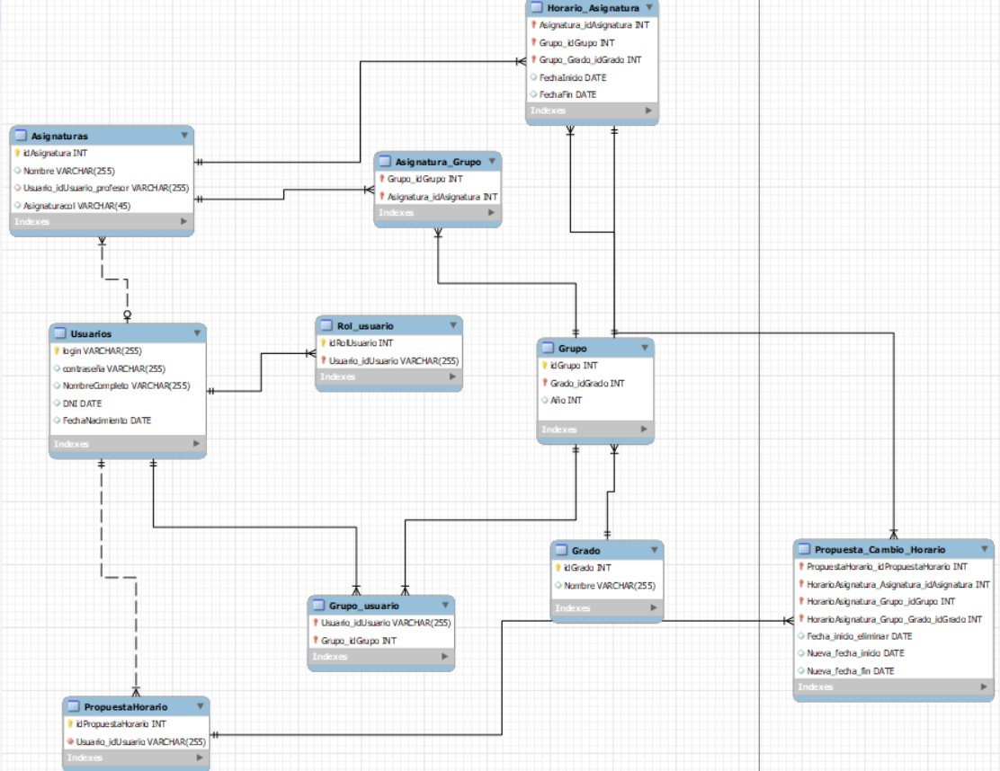

# ***Lab 1: Definición de casos de uso y requisitos de información***

$~$

## ***Índice de contenidos***

- Supuesto 1: Horarios
- Supuesto 2: Sistema de Compras

$~$

### **Supuesto 1: Horarios**

 

En una universidad, el personal del PDI, el personal del PAS y los estudiantes pueden consultar horarios. Por su parte, el personal del PAS puede modificar horarios y dar de alta estudiantes. El personal de PDI puede proponer cambios en los horarios y dar de alta estudiantes. La funcionalidad de dar de alta estudiantes del PAS realiza una verificación de los datos del estudiante. Sin embargo, la funcionalidad de dar de alta estudiantes del PDI, además de verificar los datos también permite de forma excepcional realizar la búsqueda en las listas de clase de sus asignaturas.
</div">

 

    
    <i>
Imagen 1. Diagrama del supuesto 1.
</i>

 

#### **Especificación de los Casos de Uso**

 

| Identificador                 | UC-01                         |
| :---                          |    :----                      |
| Nombre                        | Consultar horarios            |
| Autor                         | Alejandro Manzano, Cristina García y Adrian Galdeano          |
| Fecha                         | 07/10/2022                    |
| Descripción                   | Cuando un usuario solicita consultar un horario, el sistema deberá comportarse como se describe a continuación.  |
| Actores                       | Estudiante, PDI y PAS                    |
| Precondiciones                | El Estudiante está autenticado en el sistema.       |
| Flujo normal                  | 	1.- El Estudiante solicita al sistema consultar un horario.   2.- El sistema solicita al usuario la selección del nombre del grado y el año a consultar en dos desplegables.   3.- El usuario selecciona el grado y el año en el desplegable.   4.- El sistema proporciona el horario para el grado y el año deseado. Finaliza el proceso.      |
| Flujo alternativo             | 4A.- El usuario no selecciona la información en los dos desplegables, se lanza un mensaje de aviso para que el usuario rellene los campos.          |
| Poscondiciones                | Ninguna.                      |
| Comentarios                   | El desplegable del año variará en función de la selección en el desplegable del grado. Es decir, si un grado tiene 5 años, y no 4, en el desplegable aparecerán hasta 5 años si y solo si se selecciona un grado de 5 años.                  |

$~$

| Identificador                 | UC-02                         |
| :---                          |    :----                      |
| Nombre                        | Proponer cambio horario   |
| Autor                         | Cristina García, Alejandro Manzano               |
| Fecha                         | 07/10/2022                    |
| Descripción                   | Cuando PDI propone cambiar un horario, el sistema deberá comportarse como se describe a continuación.       |
| Actores                       | PDI        |
| Precondiciones                | PDI está autenticado en el sistema.       |
| Flujo normal                  | 1.- PDI solicita realizar un cambio de horario.   2.- El sistema solicita a PDI que introduzca el grado y el año, debiendo rellenar un desplegable.   3.- El usuario rellena los desplegables y transmite la información al sistema.   4.- El sistema solicita al PDI que introduzca una descripción del cambio en el horario que desea acometer.   5.- El PDI redacta los cambios que desea realizar en el horario.   6.- El sistema comprueba que PDI ha agregado la descripción.   7.- El sistema envía el grado, año y descripción proporcionada a un PAS. El proceso finaliza. | 
| Flujo alternativo             | 4.A.- El usuario no selecciona la información en los dos desplegables, se lanza un mensaje de aviso para que el usuario rellene los campos.   6.A.- El sistema lanza una alerta y solicita al usuario que agregue una descripción.         |
| Poscondiciones                | Se guarda un registro (grado, año, descripción) para que un PAS considere la modificación del horario.        |

$~$

| Identificador                 | UC-03                         |
| :---                          |    :----                      |
| Nombre                        | Dar de alta estudiante        |
| Autor                         | Cristina García               |
| Fecha                         | 07/10/2022                    |
| Descripción                   | Cuando PAS propone dar de alta a un estudiante, el sistema deberá comportarse como se describe a continuación.         |
| Actores                       | PAS                           |
| Precondiciones                | PAS debe estar auntenticado en el sistema.       |
| Flujo normal                  | 1.- PAS solicita dar de alta al Estudiante.   2.- El sistema solicita a PAS que proporcione los datos del Estudiante en diferentes inputs de texto (DNI, Nombre completo, fecha...)   3.- PAS introduce los datos del Estudiante y lo envía al sistema.   4.- El sistema verifica que todos los datos han sido rellenados de forma correcta.   5.- El sistema da de alta al Estudiante y el proceso finaliza.     |
| Flujo alternativo             | 4.A.-Si los datos no se han rellenado de forma correcta (Ej. No están todos los dígitos del DNI), PAS podrá volver a introducir los datos del Estudiante o finalizar el proceso.                       |
| Poscondiciones                | El Estudiante queda dado de alta en el sistema.    |

$~$

| Identificador                 | UC-04                         |
| :---                          |    :----                      |
| Nombre                        | Buscar listas de clase        |
| Autor                         | Cristina García               |
| Fecha                         | 07/10/2022                    |
| Descripción                   |  Cuando PDI solicita buscar listas de clase, el sistema deberá comportarse como se describe a continuación.    |
| Actores                       | PDI                           |
| Precondiciones                | PDI debe estar auntenticado en el sistema.       |
| Flujo normal                  | 1.- PDI solicita buscar las listas de clase.   2.- El sistema solicita el grado, año y grupo en tres distintos desplegables.   3.- PDI introduce los datos de la clase en los desplegables y lo envía al sistema.   4.- El sistema verifica que los desplegables estén rellenos   5.- El sistema muestra la lista de clase del grupo, grado y año elegido.       |
| Flujo alternativo             | 4.A.- El sistema muestra un mensaje de alerta si no se han rellenado todos los desplegables. El PDI podrá volver a introducir los datos o finalizar el proceso.                    |
| Poscondiciones                | Ninguna.                      |

$~$

| Identificador                 | UC-05                         |
| :---                          |    :----                      |
| Nombre                        | Verificar datos estudiantes   |
| Autor                         | Cristina García               |
| Fecha                         | 07/10/2022                    |
| Descripción                   | Cuando PAS solicita verificar los datos del estudiante, el sistema deberá comportarse como se describe a continuación.        |
| Actores                       | PAS                           |
| Precondiciones                | PAS debe estar auntenticado en el sistema.       |
| Flujo normal                  | 1.- PAS introduce los datos del Estudiante y lo envía al sistema.   2.- El sistema verifica que todos los datos han sido rellenados de forma correcta.   3.- El sistema da de alta al Estudiante y el proceso finaliza.  |
| Flujo alternativo             | 2.A.- El sistema comprueba que los datos del Estudiante se han rellenado de la forma correcta. Si no lo son, PAS podrá volver a introducir los datos o finalizar el proceso.          |
| Poscondiciones                | Ninguna.                      |
| Comentarios                   | Se entiende por verificar datos del estudiante, la comprobación de que se hayan introducido los datos de forma válida en el sistema. En el flujo se parte desde que PAS introduce los datos del estudiante, ya que forma parte del UC-03.  | 

$~$

| Identificador                 | UC-06                         |
| :---                          |    :----                      |
| Nombre                        | Modificar horario             |
| Autor                         | Cristina García               |
| Fecha                         | 07/10/2022                    |
| Descripción                   | Cuando PAS modifica un horario, el sistema deberá comportarse como se describe a continuación. |
| Actores                       | PAS                           |
| Precondiciones                | PAS debe estar auntenticado en el sistema.       |
| Flujo normal                  | 1.- PAS solicita modificar un horario.   2.- El sistema le solicita que proporcione el grado, año y grupo en tres desplegables.   3.- PAS rellena los desplegables y lo envía al sistema.   4.- El sistema verifica los desplegables   5.- El sistema solicita a PAS la asignatura a cambiar (desplegable con el nombre de las asignaturas del grupo)   6.- PAS proporciona la asignatura que desea modificar   7.- El sistema revisa la asignatura y muestra todos los horarios de la asignatura con opción para su modificación (estilo calendario de HTML).   8.- PAS modifica los horarios de la asignatura deseados y lo envía al sistema   9.- El sistema verifica los horarios establecidos.   10.- El sistema aprueba los cambios y el proceso finaliza.            |
| Flujo alternativo             | 4.A.- Si no se rellenan todos los desplegables, se lanza una alerta y se permite volver a hacerlo o finalizar el proceso.   7.A.- Si no se proporciona la asignatura, lanza un aviso y se permite volver a proporcionarla o finalizar el proceso.   9.A.- Si se ha introducido algún horario en un día festivo, el sistema informará y permitirá cambiarlo.          |
| Poscondiciones                | Los cambios en el horario han sido actualizados.                      |

$~$

| Identificador                 | UC-07                         |
| :---                          |    :----                      |
| Nombre                        | Dar de alta estudiante vista PDI        |
| Autor                         | Cristina García               |
| Fecha                         | 08/10/2022                    |
| Descripción                   | Cuando PDI solicita dar de alta a un estudiante, el sistema deberá comportarse como se describe a continuación.      |
| Actores                       | PDI                           |
| Precondiciones                | PDI debe estar auntenticado en el sistema.       |
| Flujo normal                  | 1.- PDI solicita dar de alta al Estudiante.   2.- El sistema solicita a PDI que proporcione los datos del Estudiante en diferentes inputs de texto (DNI, Nombre completo, fecha...)   3.- PDI introduce los datos del Estudiante y lo envía al sistema.   4.- El sistema verifica que todos los datos han sido rellenados de forma correcta.   5.- El sistema da de alta al Estudiante y el proceso finaliza.   |
| Flujo alternativo				| 4.A.-Si los datos no se han rellenado de forma correcta (Ej. No están todos los dígitos del DNI), PAS podrá volver a introducir los datos del Estudiante o finalizar el proceso.   5.A- PDI solicita buscar las listas de clase.   6.A.- El sistema solicita el grado, año y grupo en tres distintos desplegables.   7.A.- PDI introduce los datos de la clase en los desplegables y lo envía al sistema.   8.A.- El sistema verifica que los desplegables estén rellenos   9.A.- El sistema muestra la lista de clase del grupo, grado y año elegido.   10.A.-El sistema da de alta al Estudiante y el proceso finaliza.|
| Poscondiciones                | El Estudiante está dado de alta.                      |

$~$

#### **Requisitos de la información**

| RI-01                    | HorarioAsignatura               |
| :---                     | :---                          |
| Requisitos asiciados     | UC-01         |
| Descripción              | El sistema deberá almacenar información correspondiente a cuándo se imparte una determinada asignatura, para así formar el horario completo de un grupo.           |
| Datos específicos        | HorarioAsignatura:   -idAsignatura (entero)   -idGrupo (entero)   -idGrado (entero)   -FechaInicio (dd/mm/aaaa hh:mm)   -FechaFin (dd/mm/aaaa hh:mm).|
| Comentarios               | Ninguno. |

 

| RI-02                    | Asignaturas               |
| :---                     | :---                          |
| Requisitos asiciados     | UC-01         |
| Descripción              | El sistema deberá almacenar información correspondiente a cada asignatura de la universidad.           |
| Datos específicos        | -idAsignatura (entero)   -Nombre asignatura: 255 caracteres   -Profesor: 255 caracteres |
| Comentarios               | Ninguno. |

 

| RI-03                    | Usuarios               |
| :---                     | :---                          |
| Requisitos asiciados     | UC-01         |
| Descripción              | El sistema deberá almacenar información correspondiente a los usuarios del sistema, PDI, PAS y Estudiante |
| Datos específicos        | -login (255 caracteres)  -contraseña (255 caracteres)   NombreCompleto (255 caracteres)   DNI (XXXXXXXX-A)   -FechaNacimiento: dd/mm/aaaa hh:mm |
| Comentarios               | Ninguno. |

 

| RI-04                    | Rol de usuario                |
| :---                     | :---                          |
| Requisitos asiciados     | UC-02                         |
| Descripción              | Un usuario puede ser Estudiante, PDI y PAS simultánemeante, o cualquier combinación de estos.    |
| Datos específicos        | -login (255 caracteres)   idRolUsuario (entero)  |
| Comentarios               | Ninguno. |

 

| RI-05                    | Grupos                        |
| :---                     | :---                          |
| Requisitos asiciados     | UC-03                         |
| Descripción              | El sistema deberá almacenar información correspondiente a cada grupo. Un grupo es una clase de un grado.       | |
| Datos específicos        | -idGrupo (entero)   -idAsignatura (entero)   -año (entero)  |
| Comentarios               | Se considera que todos los estudiantes con mismpo grado y año, se encuentran en la misma lista de clase. |

 

| RI-06                    | Grados               |
| :---                     | :---                          |
| Requisitos asiciados     | UC-04, UC-05         |
| Descripción              | El sistema deberá almacenar información correspondiente a cada Grado ofertado por la universidad         |
| Datos específicos        | -idGrado (entero)   -Nombre (255 caracteres)|
| Comentarios               | Ninguno. |

 

| RI-07                    | Usuario_Grupo            |
| :---                     | :---                          |
| Requisitos asiciados     | UC-03        |
| Descripción              | El sistema deberá almacenar información correspondiente al grupo al que pertenece cada usuario Estudiante.           |
| Datos específicos        | -idUsuario (entero)   -idGrupo (entero)|
| Comentarios               | El identificador se corresponderá con el DNI del usuario |

 

    
    <i>
Imagen 2. Diagrama Entidad-Relación del Supuesto 1.
</i>

 

### **Supuesto 2: Sistema de Compras**

 

En un sistema de compra, existen cuatro tipos de usuarios: comprador, vendedor, proveedor y administrador. Los compradores pueden agregar productos, consultar precios, finalizar la compra y consultar ofertas. Agregar productos implica marcar esos productos como bloqueados. Los vendedores también pueden consultar ofertas y consultar precios. Los proveedores pueden consultar precios, avisar de nuevos productos y consultar ofertas. Avisar de nuevos productos, de forma excepcional, realiza la incorporación de una oferta. Los proveedores también tienen una funcionalidad para avisar del fin de una oferta. Cuando se avisa del fin de una oferta, se ejecuta la funcionalidad de eliminar la oferta. Ambas funcionalidades de avisar del proveedor tienen en común que se encarga de enviar una notificación. Los administradores pueden consultar precios, consultar ofertas y eliminar productos. La funcionalidad de consultar precios incluye una funcionalidad de buscar productos que es similar a la funcionalidad de consultar productos de los compradores. Sin embargo, la funcionalidad de consultar productos añade una funcionalidad para verificar la disponibilidad. Para realizar una venta, un comprador y un vendedor participan de forma conjunta. En dicha operación, se lleva a cabo el acuerdo de un precio; excepcionalmente, durante la realización de la venta, se consultará el histórico de ventas.
</div">

 

    
    <i>
Imagen 2. Diagrama del supuesto 2.
</i>

 

#### **Especificación de los Casos de Uso**

 

| Identificador                 | UC-01                         |
| :---                          | :----                         |
| Nombre                        | Consultar ofertas             |
| Autor                         | Cristina García, Adrián Galdeano               |
| Fecha                         | 26/10/2022                    |
| Descripción                   | Cuando se solicita consultar ofertas, el sistema deberá comportarse como se describe a continuación.        |
| Actores                       | Comun, Proveedor, Vendedor, Comprador y Administrador                           |
| Precondiciones                | El usuario debe haber accedido al sistema de compra.       |
| Flujo normal                  | 1.- El usuario solicita consultar las ofertas disponibles.   2.- El sistema recopila las ofertas y las muestra en orden.           |
| Flujo alternativo             | 2.A.- Si el sistema no encuentra alguna oferta disponible, muestra un mensaje indicándolo.     |
| Poscondiciones                | Ninguna.                      |

  

| Identificador                 | UC-02                         |
| :---                          | :----                         |
| Nombre                        | Consultar precios             |
| Autor                         | Cristina García               |
| Fecha                         | 09/10/2022                    |
| Descripción                   | Cuando se solicita consultar precios, el sistema deberá comportarse como se describe a continuación.       |
| Actores                       | Comun, Proveedor, Vendedor, Comprador y Administrador                           |
| Precondiciones                | El usuario debe haber accedido al sistema de compra.       |
| Flujo normal                  | 1.- El usuario proporciona un intervalo de precios deseado.   2.- El sistema busca los productos que entren en el rango de dicho precio y los muestra según el criterio de ordenación establecido. 
| Flujo alternativo             | 2.A.- Si el sistema no localiza ningún producto por el precio deseado, devolverá un mensaje de error.     |
| Poscondiciones                | Ninguna.                      |

  

| Identificador                 | UC-03                         |
| :---                          | :----                         |
| Nombre                        | Finalizar compra              |
| Autor                         | Cristina García, Adrián Galdeano               |
| Fecha                         | 09/10/2022                    |
| Descripción                   | Cuando se solicita finalizar compra, el sistema deberá comportarse como se describe a continuación.          |
| Actores                       | Comprador          |
| Precondiciones                | El Comprador debe haber accedido al sistema de compra. El comprador debe estar autenticado.       |
| Flujo normal                  | 1.- El Comprador solicita finalizar la compra de los productos escogidos previamente.   2.- El sistema solicita los datos de facturación del Comprador para poder realizar la compra.   3.- El Comprador introduce los datos de facturación y se los proporciona al sistema.   4.- El sistema valida los datos de facturación.   5.- El sistema solicita dirección de envío.   6.- El cliente proporciona la dirección de envío.   7.- El sistema verifica la dirección de envío y confirma la compra, mostrando un resguardo tanto en el propio sistema de compras como a través de un correo.            |
| Flujo alternativo             | 4.A.- El sistema comprueba que todos los los datos de facturación sean válidos. Si no lo han sido, el Comprador podrá volver a introducir los datos (paso 3) o finalizar el proceso.   7.A El sistema comprueba la dirección de envío, si no es válida podrá volver a introducirla (paso 6)|
| Poscondiciones                | El Comprador ha realizado la compra y queda registrada en el sistema                      |

  

| Identificador                 | UC-04                         |
| :---                          | :----                         |
| Nombre                        | Eliminar producto             |
| Autor                         | Cristina García               |
| Fecha                         | 26/10/2022                    |
| Descripción                   | Cuando se solicita eliminar producto, el sistema deberá comportarse como se describe a continuación.          |
| Actores                       | Administrador          |
| Precondiciones                | El Administrador debe haber accedido al sistema de compra y estar autenticado.       |
| Flujo normal                  | 1.- El Adminsitrador realiza la búsqueda del identificador del producto a eliminar   2.- El sistema comprueba la ID del producto, muestra el producto y sus datos y un check-box para su eliminación.   3.- El administrador pulsa el check-boc para eliminar el producto y se envía al sistema   4.- El sistema elimina el producto de sus registros     |
| Flujo alternativo             | 2.A.- Si el sistema no dispone de la ID introducida, mostrará un mensaje   |
| Poscondiciones                | El producto será eliminado del sistema de compras.                      |

  

| Identificador                 | UC-05                         |
| :---                          | :----                         |
| Nombre                        | Agregar producto             |
| Autor                         | Alejandro Manzano, Adrián Galdeano               |
| Fecha                         | 26/10/2022                    |
| Descripción                   | Cuando se solicita agregar producto, el sistema deberá comportarse como se describe a continuación.          |
| Actores                       | Comprador          |
| Precondiciones                | El producto no está marcado como bloqueado. El comprador está autenticado en el sistema.      |
| Flujo normal                  | 1.- El Comprador busca en un buscador el producto deseado por su nombre   2.- El sistema comprueba y muestra los productos relacionados a la búsqueda, con una opción de añadir para cada producto y otra opción para indicar la cantidad.   3.- El Comprador pulsa en añadir, selecciona la cantidad deseada y lo envía al sistema   4.- El sistema le agrega el producto deseado, disminuyendo en X su stock (X es la cantidad de productos seleccionados). Si el stock llega a 0, marca el producto como bloqueado.     |
| Flujo alternativo             | 2.A.- Si el sistema no encuentra ningún producto relacionado con la búsqueda manda un mensaje de error.  4.- Si no hay suficiente producto en stock, el sistema lanzará una alerta
indicándolo.   |
| Poscondiciones                | Disminuye el stock del producto en el sistema en función de la cantidad agregada por el Comprador.             |

  

| Identificador                 | UC-06                         |
| :---                          | :----                         |
| Nombre                        | Marcar producto como bloqueado             |
| Autor                         | Alejandro Manzano, Adrián Galdeano               |
| Fecha                         | 26/10/2022                    |
| Descripción                   | Permite que al sistema marcar un producto como bloqueado cuando este añadadido al carro del Comprador.       |
| Actores                       | Comprador          |
| Precondiciones                | El Comprador ha añadido seleccionado la opción de agregar un producto a su carro.      |
| Flujo normal                  | 1.- El sistema busca el producto y cambia el campo de disponibilidad, que determina si este está bloqueado o no.   2.- La interfaz se actualiza y se muestra el producto como bloqueado.          |
| Flujo alternativo             | 1.A.- Si el sistema no encuentra el producto devuelve un mensaje de error.   |
| Poscondiciones                | El producto ha quedado marcado como bloqueado por el sistema de compras.                      |

  

| Identificador                 | UC-07                         |
| :---                          | :----                         |
| Nombre                        | Consultar producto             |
| Autor                         | Alejandro Manzano               |
| Fecha                         | 11/10/2022                    |
| Descripción                   | Permite al Comprador consultar los detalles de los productos en los que esté interesado.       |
| Actores                       | Comprador          |
| Precondiciones                | Ninguna. |
| Flujo normal                  | 1.- El Comprador selecciona un producto del cual quiere consultar sus características.   2.- El sistema busca las características del producto y verifica la disponibilidad del mismo.   El sistema muestra en una nueva interfaz todas las características del producto, y si está disponible o no para ser comprado.          |
| Flujo alternativo             | 2.A.- Si el sistema no encuentra el producto devolverá un mensaje de error.   |
| Poscondiciones                | Ninguna.                      |

  

| Identificador                 | UC-08                         |
| :---                          | :----                         |
| Nombre                        | Verificar disponibilidad             |
| Autor                         | Alejandro Manzano, Adrián Galdeano               |
| Fecha                         | 26/10/2022                    |
| Descripción                   | Cuando se solicita verificar disponibilidad, el sistema deberá comportarse como se describe a continuación.         |
| Actores                       | Comprador          |
| Precondiciones                | El Comprador está autenticado. |
| Flujo normal                  | 1.- El comprador escribe el nombre del producto y lo envía al sistema.   2.- El sistema obtiene los productos relacionados con la búsqueda y los muestra, indicando su disponibilidad.   |
| Flujo alternativo             | 1.A.- Si el sistema no encuentra ningún producto relacionado devolverá un mensaje de error.   |
| Poscondiciones                | Ninguna.              |

  

| Identificador                 | UC-09                         |
| :---                          | :----                         |
| Nombre                        | Buscar productos              |
| Autor                         | Cristina García, Adrián Galdeano                |
| Fecha                         | 26/10/2022                    |
| Descripción                   | Cuando se solicita buscar productos, el sistema deberá comportarse como se describe a continuación.         |
| Actores                       | Comun                         |
| Precondiciones                | El usuario debe haber accedido al sistema de compra.       |
| Flujo normal                  |  1.- El usuario introduce el nombre del producto en el buscador.   2.- El sistema busca los productos que coincidan con el nombre introducido por el usuario. El sistema dispone los productos relacionados de forma ordenada según criterio establecido. Para cada producto se disponen datos básicos de este, nombre, precio, stock.     |
| Flujo alternativo             | 2.A.- Si el sistema no encuentra ningún producto, devolverá un mensaje de error, permitiendo al usuario volver a buscar un producto (paso 1) o finalizar el proceso.   |
| Poscondiciones                | Ninguna. 

 

| Identificador                 | UC-10                         |
| :---                          | :----                         |
| Nombre                        | Consultar histórico de ventas         |
| Autor                         | Cristina García, Adrián Galdeano               |
| Fecha                         | 26/10/2022                    |
| Descripción                   | Cuando se solicita consultar histórico de ventas, el sistema deberá comportarse como se describe a continuación.        |
| Actores                       | Comprador y Vendedor          |
| Precondiciones                | Comprador y Vendedor deben estar autenticados en el sistema.       |
| Flujo normal                  |  1.- El usuario solicita consultar el histórico de ventas de un producto.   2.- El sistema solicita la ID del producto   3.- El usuario proporciona la ID del producto deseado   4.- El sistema muestra el histórico de ventas ordenadas según la fecha de venta.     |
| Flujo alternativo             | 3.A.- Si el sistema no encuentra la ID, lanzará un aviso.  4.A Si el producto no se ha vendido todavía, mostrá un aviso   |
| Poscondiciones                | Ninguna. 

 

| Identificador                 | UC-11                         |
| :---                          | :----                         |
| Nombre                        | Incorporar oferta        |
| Autor                         | Cristina García, Adrián Galdeano               |
| Fecha                         | 26/10/2022                    |
| Descripción                   | Cuando se solicita incorporar oferta, el sistema deberá comportarse como se describe a continuación.          |
| Actores                       | Proveedor          |
| Precondiciones                | El Proveedor debe haber accedido al sistema de compra y estar autenticado.       |
| Flujo normal                  |  1.- El Proveedor solicita incorporar una oferta nueva.   2.- El sistema solicita la ID del producto a poner en oferta   3.- El Proveedor introduce la ID del producto deseado   4.- El sistema solicita el % de descuento a establecer en el producto.   5.-El Proveedor introduce el % deseado de descuento   6.- El sistema aplica el descuento al producto.       |
| Flujo alternativo             | 2.A.- Si el sistema no encuentra la oferta el producto, lanza un aviso.   6.A- Si el % se ha introducido de forma errónea, se lanza un error.|
| Poscondiciones                | Se agrega la oferta al sistema.  |

 

| Identificador                 | UC-12                         |
| :---                          | :----                         |
| Nombre                        | Realizar Venta        |
| Autor                         | Alejandro Manzano, Adrián Galdeano               |
| Fecha                         | 26/10/2022                    |
| Descripción                   | Cuando se solicita realizar venta, el sistema deberá comportarse como se describe a continuación.      |
| Actores                       | Vendedor y Comprador          |
| Precondiciones                | Comprador y Vendedor están autenticados     |
| Flujo normal                  |  1.- Una vez el Comprador ha agregado todos los productos deseados, solicita realizar venta.   2.- El sistema informa al Vendedor, proporcionándole un botón para aceptar o rechazar la venta.   3.- El vendedor aprueba la venta   4.- El sistema solicita al Comprador si quiere introducir un precio alternativo para cada producto.   5.- El usuario introduce un precio alternativo.   6. El sistema informa al Vendedor del precio propuesto y permite al Vendedor aceptar o rechazar la venta..   7.- El Vendedor acepta la venta.   8.- El sistema registra la venta.    |
| Flujo alternativo             | 3.A- El vendedor rechaza la venta. El proceso termina.   4.A.- De forma opcional se puede consultar el histórico de ventas para ver los precios a los que se ha vendido dicho producto con anterioridad y fijar un precio acorde a estas ventas. 6.A.- El Comprador no introduce un nuevo precio. El proceso contúa. 7.A.- El Vendedor rechaza la venta, el proceso culmina.  |
| Poscondiciones                | Se actualiza el stock de los productos involucrados, se registra la venta en el sistema. |

 

| Identificador                 | UC-13                         |
| :---                          | :----                         |
| Nombre                        | Acordar precio        |
| Autor                         | Alejandro Manzano, Adrián Galdeano               |
| Fecha                         | 26/10/2022                    |
| Descripción                   | Cuando se solicita acordar precio, el sistema deberá comportarse como se describe a continuación.     |
| Actores                       | Vendedor y Comprador          |
| Precondiciones                | Se ha iniciado el proceso la realización de una venta de un producto.       |
| Flujo normal                  | 1.- El vendedor aprueba la venta e informa de ello al sistema.   4.- El sistema solicita al Comprador si quiere introducir un precio alternativo para cada producto, dándole opción para introducir el precio.   5.- El usuario introduce un precio alternativo.   6.- El sistema informa al Vendedor del precio propuesto y permite al Vendedor aceptar o rechazar la venta. |
| Flujo alternativo             | 5.A.- El usuario no introduce un precio alternativo, el proceso continúa. |
| Poscondiciones                | Ninguna. |

 

| Identificador                 | UC-14                         |
| :---                          | :----                         |
| Nombre                        | Avisar nuevos productos        |
| Autor                         | Alejandro Manzano, Adrián Galdeano               |
| Fecha                         | 26/10/2022                    |
| Descripción                   | Cuando se solicita avisar de nuevos productos, el sistema deberá comportarse como se describe a continuación.     |
| Actores                       | Proveedor          |
| Precondiciones                | El proveedor tiene nuevos productos que notificar. El Proveedor está autenticado.      |
| Flujo normal                  |  1.- El Proveedor incorpora los nuevos productos al sistema. De forma excepcional, el proveedor puede incorporar una oferta a los productos.  El proveedor solicita avisar de los nuevos productos.   2. El sistema reconoce los nuevos productos que previamente introdujo el Proveedor y envía una notificación a los usuarios del sistema.      |
| Flujo alternativo             | 2.A.- Si el sistema no encuentra productos nuevos del Proveedor, el proceso culmina. No se notifica. |
| Poscondiciones                | Los usuarios del sistema reciben una notificación que les avisa de los nuevos productos. |

 

| Identificador                 | UC-15                         |
| :---                          | :----                         |
| Nombre                        | Avisar fin de oferta        |
| Autor                         | Alejandro Manzano, Adrián Galdeano               |
| Fecha                         | 26/10/2022                    |
| Descripción                   | Cuando se solicita avisar del fin de oferta, el sistema deberá comportarse como se describe a continuación.    |
| Actores                       | Proveedor          |
| Precondiciones                |    El producto tenía una oferta incorporada y está registrado en el sistema.    |
| Flujo normal                  |  1.- El proveedor solicita al sistema avisar del fin de una oferta  2.- El sistema solicita al Proveedor que proporcione la ID del producto a avisar.  3.- El proveedor proporciona la ID del producto.  4.- El sistema verifica la ID y que el producto esté en oferta y su oferta vaya a expirar en los próximos días. Se notifica el fin de la oferta a los usuarios.     |
| Flujo alternativo             | 4.A.- Si la ID es incorrecta, se envía un error.   4.B.- Si la oferta no va a expirar pronto, el proceso termina. |
| Poscondiciones                | Los usuarios del sistema reciben una notificación que les avisa de que una oferta finalizará pronto. |

 

| Identificador                 | UC-16                         |
| :---                          | :----                         |
| Nombre                        | Eliminar oferta        |
| Autor                         | Alejandro Manzano, Adrián Galdeano               |
| Fecha                         | 26/10/2022                    |
| Descripción                   | Cuando se solicita eliminar oferta, el sistema deberá comportarse como se describe a continuación. |
| Actores                       | Proveedor          |
| Precondiciones                | Ninguna.    |
| Flujo normal                  |  1.- El sistema verifica la fecha de fin de oferta, si se ha alcanzado esa fecha, el sistema establece el precio del producto a su valor original.     |
| Flujo alternativo             | 1.A- Mientras no se alcance la fecha, el producto seguirá en oferta. |
| Poscondiciones                | El producto ya no está en oferta. |

 

| Identificador                 | UC-17                         |
| :---                          | :----                         |
| Nombre                        | Avisar        |
| Autor                         | Alejandro Manzano, Adrián Galdeano               |
| Fecha                         | 26/10/2022                    |
| Descripción                   | Cuando se solicita avisar, el sistema deberá comportarse como se describe a continuación.    |
| Actores                       | Proveedor          |
| Precondiciones                | El proveedor está autenticado.       |
| Flujo normal                  |  1.- El Proveedor realiza los cambios en sus productos e incorporaciones de sus productos al sistema.   2.- El sistema analiza los nuevos productos y cambios del Proveedor.   3.- El sistema envía una notificación a los usuarios.     |
| Flujo alternativo             | Ninguno. |
| Poscondiciones                | Los usuarios del sistema reciben una notificación. |

 

| Identificador                 | UC-18                         |
| :---                          | :----                         |
| Nombre                        | Enviar notificación        |
| Autor                         | Alejandro Manzano, Adrián Galdeano               |
| Fecha                         | 26/10/2022                    |
| Descripción                   | Cuando se solicita enviar notificación, el sistema deberá comportarse como se describe a continuación.  |
| Actores                       | Proveedor          |
| Precondiciones                | El avisa de nueva información en sus productos.       |
| Flujo normal                  |  1.- El sistema selecciona todos los usuarios del sistema y les envía una notificación indicando, el producto o lista de productos y sus detalles.    |
| Flujo alternativo             | Ninguno. |
| Poscondiciones                | Los usuarios reciben una notificación. |

 

#### **Requisitos de la información**

 

| RI-01                    | Información sobre ofertas             |
| :---                     | :---                          |
| Requisitos asiciados     | UC-01, UC-15       |
| Descripción              | El sistema deberá almacenar información correspondiente a las ofertas.          |
| Datos específicos        | Identificador de producto : entero   %de descuento: dos dígitos   Fecha inicio de oferta: dd/mm/aaaa hh:mm   Fecha fin de oferta: dd/mm/aaaa hh:mm |
| Comentarios               | El identificador se corresponderá con el ID del producto. |

 

| RI-02                    | Información sobre productos             |
| :---                     | :---                          |
| Requisitos asiciados     | UC-02, UC-04, UC-05, UC-06, UC-14       |
| Descripción              | El sistema deberá almacenar información correspondiente a los productos.          |
| Datos específicos        | Identificador de producto : entero    Precio: entero.   Nombre de producto: 255 caracteres.   Stock: 10 dígitos.   Fecha publicación: dd/mm/aaaa|
| Comentarios               | Ninguno.|

 

| RI-03                    | Información sobre compras             |
| :---                     | :---                          |
| Requisitos asiciados     | UC-03        |
| Descripción              | El sistema deberá almacenar información correspondiente a las compras registradas.          |
| Datos específicos        | Identificador de compra : entero   Dirección de envío: 200 caracteres   Precio de compra: entero |
| Comentarios               | Ninguno.|

 

| RI-04                    | Información sobre agregar productos. (Carrito)             |
| :---                     | :---                          |
| Requisitos asiciados     | UC-05        |
| Descripción              | El sistema deberá almacenar información correspondiente a la selección de productos a comprar por los Compradores.         |
| Datos específicos        | Identificador de carrito : entero    Itentificador de producto: entero. |
| Comentarios               | Ninguno.|

 

| RI-05                    | Información sobre ventas.            |
| :---                     | :---                          |
| Requisitos asiciados     | UC-10        |
| Descripción              | El sistema deberá almacenar información correspondiente a las ventas.         |
| Datos específicos        | Identificador de venta : entero   Itentificador de compra: entero   Fecha: dd/mm/aaaa |
| Comentarios               | Ninguno.|

 

| RI-06                    | Información sobre Usuarios.            |
| :---                     | :---                          |
| Requisitos asiciados     | UC-04, UC-05, UC-06, UC-10, UC-12, UC-13, UC-14, UC-15        |
| Descripción              | El sistema deberá almacenar información correspondiente a los usuarios.         |
| Datos específicos        | Identificador de usuario : cadena    Contraseña : cadena   ROL: entero. |
| Comentarios               | El rol es un número que proporciona privilegios a un usuario. Si el número es 0 será comprador, 1 implica ser Vendedor, 2 Proveedor y 3 Administrador.|

 

    
    <i>
Imagen 4. Diagrama Entidad-Relación del Supuesto 2.
</i>

